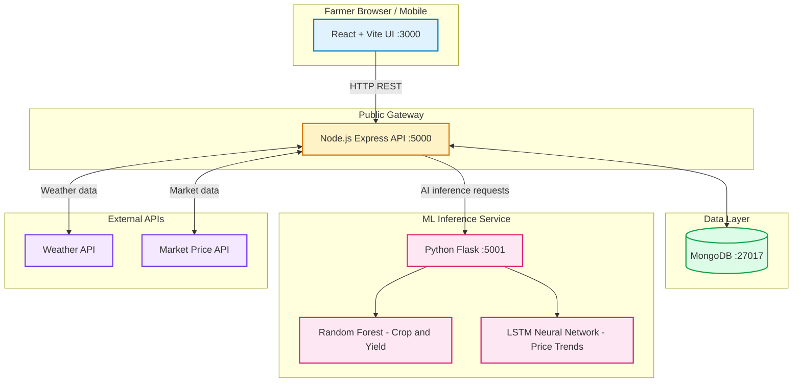
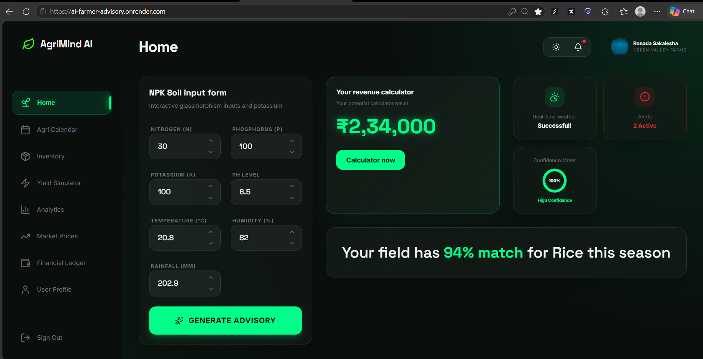
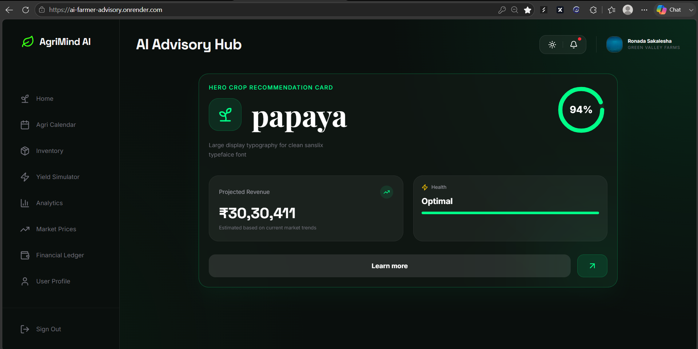
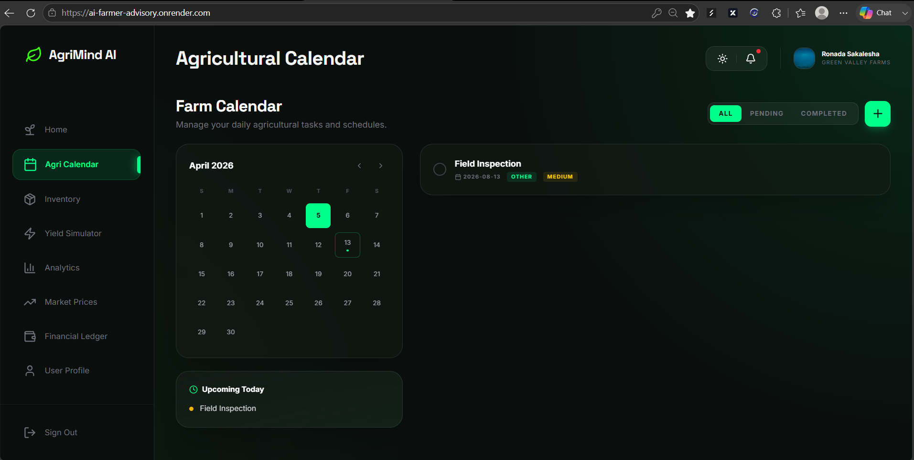
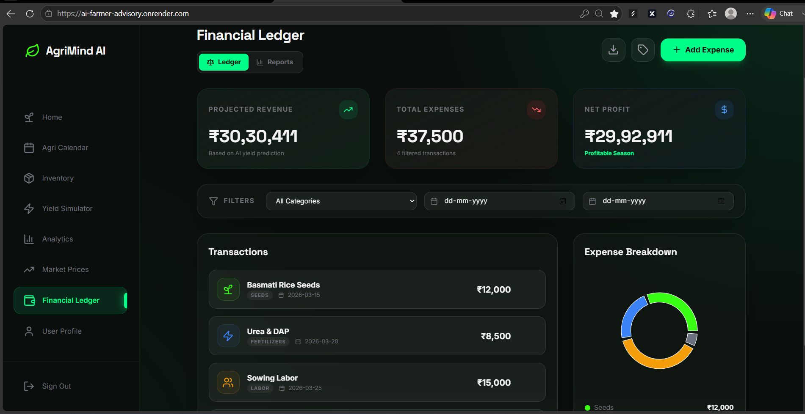
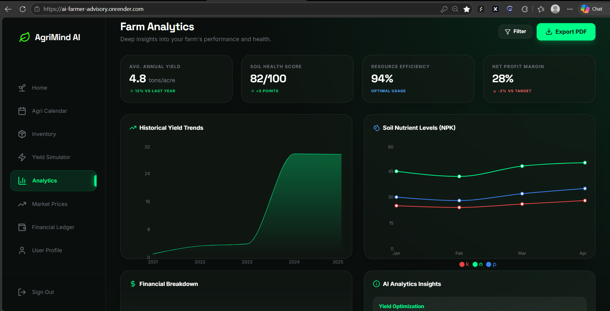

# AgriMindAI

AI-Powered Farmer Advisory Platform that addresses the agricultural "Triple Crisis" — agronomic uncertainty, climate unpredictability, and market volatility — by delivering intelligent crop recommendations, yield predictions, price trend forecasts, and real-time weather insights in a single decision-support system.

## Problem

Small-scale farmers make critical decisions with fragmented or outdated information:

- **Agronomic Uncertainty** — Soil nutrient levels (N, P, K) and pH are unknown, leading to incompatible crop selection, poor yields, and soil exhaustion.
- **Climate Unpredictability** — Erratic rainfall, temperature, and humidity make traditional planting cycles unreliable, causing crop failures during extreme weather.
- **Market Volatility** — Without real-time price trends and demand forecasts, farmers grow oversupplied crops and sell at a loss or rely on predatory middlemen.

## Solution

AgriMindAI integrates the components above into a unified workflow. The ML models are the core intelligence:

| Module | ML Approach | Accuracy / Error | Purpose |
|--------|-------------|------------------|---------|
| Crop Recommendation | Random Forest / Decision Tree | ~99.5% / ~97.9% | Predict the best crop based on soil NPK, pH, humidity, and rainfall |
| Yield Prediction | Random Forest Regressor | MAE ~1.08 tons/ha | Estimate harvest volume before planting |
| Price Forecasting | LSTM (TensorFlow) | — | Forecast price direction (up/down/stable) so farmers plant profitable crops |
| Weather Integration | Real-time weather APIs | — | Inform planting cycles and irrigation decisions |

Random Forest was chosen because crop viability follows rule-based thresholds (e.g., "If Nitrogen > 50 AND pH 6.0–7.0, plant Rice"). Decision Trees mimic this "if-this-then-that" logic naturally, and the Random Forest ensemble prevents overfitting by averaging hundreds of trees. For yield, the Regressor handles non-linear relationships between soil, weather, and harvest volume while ignoring outlier anomalies like droughts.

For pricing, the LSTM neural network captures temporal dependencies in market data that tree-based models cannot — prices from previous days influence tomorrow's value, and LSTMs excel at learning these sequences.

## Features

- **Crop Recommendation** — Enter soil NPK, pH, humidity, and rainfall to get the optimal crop to plant, backed by a Random Forest model with ~99.5% accuracy.
- **Yield Estimation** — Get projected harvest volume (in tons/hectare) before planting using a Random Forest Regressor (MAE ~1.08).
- **Price Trend Forecasting** — LSTM-based model predicts whether crop prices will trend up, down, or stay stable — so farmers plant what will actually be profitable at harvest.
- **Real-Time Weather Integration** — Live weather data and forecasts inform planting cycles, irrigation needs, and risk of extreme weather events.
- **Personalized Irrigation Guidance** — Rule-based irrigation scheduling tailored to crop type and current weather conditions.
- **Financial Ledger** — Track all farming expenses (seeds, fertilizers, labor, equipment) and income per crop season, with profitability summaries.
- **Agri Calendar** — Planting and harvesting schedule guidance synced with weather forecasts and crop recommendations.
- **Inventory & Equipment Tracking** — Manage seed stock, fertilizer levels, and machinery availability across seasons.
- **Analytics Dashboard** — Review historical recommendations, yield outcomes, and financial performance across multiple seasons.
- **Recommendation History** — Revisit and compare past AI recommendations and adjust strategies over time.
- **Multi-Language Support** — UI available in local languages for farmer accessibility.

## Tech Stack

### Backend

| Component | Technology | Role |
|-----------|-----------|------|
| Runtime | Node.js (>= 20) | Server-side JavaScript runtime for the API gateway |
| Framework | Express.js 5 | Lightweight web framework handling routing, middleware, and request lifecycle |
| Database | MongoDB (via Mongoose 9) | NoSQL document store for user profiles, recommendation history, and financial records |
| ORM | Mongoose | Object-data mapping with schema validation and query building for MongoDB |
| Auth | JSON Web Tokens (JWT) | Stateless authentication so the frontend can rehydrate sessions without server-side state |
| Auth | bcrypt | Secure password hashing before storage in MongoDB |
| Validation | Zod | Runtime input validation on every API route — rejects malformed payloads early |
| Rate Limiting | express-rate-limit | Abuse protection — caps requests per IP to prevent brute-force and model-inference flooding |
| Caching | lru-cache | In-memory caching of weather API responses and recent recommendations to reduce latency |

### Machine Learning Service

| Component | Technology | Role |
|-----------|-----------|------|
| Runtime | Python (>= 3.11) | Language for data science and model training |
| Framework | Flask | Micro web framework exposing pre-trained models over HTTP |
| ML | Scikit-Learn | Powers the Random Forest classifier (crop recommendation, ~99.5% accuracy) and regressor (yield prediction, MAE ~1.08) |
| ML | TensorFlow | Powers the LSTM neural network for multi-day crop price trend forecasting |
| Data | NumPy + Pandas | Numerical computing and data manipulation for model preprocessing |
| Serialization | joblib | Persisting and loading trained model weights efficiently |
| Deployment | gunicorn | Production WSGI server for the Flask ML service |

### Frontend

| Component | Technology | Role |
|-----------|-----------|------|
| Framework | React 19 | Component-based UI library with hooks and concurrent rendering |
| Build Tool | Vite 6 | Fast dev server with native ES module support and hot-module replacement |
| Styling | Tailwind CSS | Utility-first CSS framework for responsive, mobile-first UI |
| Charts | Recharts | Declarative chart components for analytics dashboards |
| Icons | Lucide React | Lightweight SVG icon library |
| Animations | Motion One | Performance-optimized animations for UI transitions |
| i18n | i18next / react-i18next | Multi-language support so the UI can be localized for farmers |
| PDF Export | jsPDF + html2canvas | Allows farmers to export recommendations and financial reports as shareable PDFs |
| PWA | vite-plugin-pwa | Offline-capable web app installable on mobile devices |

### Infrastructure

| Component | Technology | Role |
|-----------|-----------|------|
| Containerization | Docker | Reproducible deployments across environments |
| Process Manager | Node --watch | Hot-reload during backend development |
| Concurrency | concurrently | Runs backend + frontend + ML services in a single dev command |

## Architecture



**Request flow:**

1. **Frontend** sends HTTP REST requests to the Node.js/Express API gateway.
2. **API Gateway** handles authentication, user management, weather, and market routes — reading/writing to MongoDB directly.
3. **API Gateway** forwards AI inference requests (crop recommendation, yield, price forecast) to the Python/Flask ML microservice.
4. **ML Service** loads pre-trained models in memory: Random Forest for crop/yield, LSTM for price trends.
5. **External APIs** supply live weather and market data that the backend caches and feeds to models.
6. The **response** (with model predictions) is stored in MongoDB for history tracking and returned to the frontend dashboard.

## Project Structure

```
AgriMindAI/
├── package.json          # Root scripts: npm run dev (backend+frontend), npm run full-stack (adds ML)
├── start.sh              # Docker entrypoint for production
├── Dockerfile            # Production container definition
├── frontend/             # React + Vite + Tailwind client app
│   ├── src/
│   │   ├── pages/        # Dashboard, MarketInsights, YieldSimulator, AnalyticsDashboard,
│   │   │                 #   FinancialLedger, AgriCalendar, InventoryManager, etc.
│   │   └── components/   # RecommendationCard, SoilInputForm, WeatherWidget, Sidebar
│   └── metadata.json     # Build/deployment metadata
├── backend/              # Node.js Express API gateway
│   ├── src/
│   │   ├── routes/       # auth, recommend, weather, market, history — URL endpoints
│   │   ├── controllers/  # Business logic per route (auth, recommendation, market, weather)
│   │   ├── models/       # Mongoose schemas: User, Recommendation
│   │   ├── middleware/   # JWT auth, Zod validation, rate limiting
│   │   ├── validators/   # Route-specific input validation schemas
│   │   └── data/         # Static reference data (crop requirements, market prices)
│   └── package.json      # Express, Mongoose, JWT, bcrypt, axios, cors
├── ml/                   # Python ML inference microservice
│   ├── ml_api.py         # Flask API: loads models, serves predictions on :5001
│   ├── requirements.txt  # scikit-learn, tensorflow, numpy, pandas, flask, gunicorn
│   ├── models/           # Serialized model artifacts (Random Forest, LSTM weights)
│   └── data/             # Training datasets, crop price history
└── PROBLEM_STATEMENT.md  # Full triple-crisis problem analysis
```

**How the pieces fit together:**

| Directory | Responsibility |
|-----------|---------------|
| `frontend/` | Farmer-facing UI — recommendation forms, dashboards, financial tracking, and PWA support for mobile use |
| `backend/` | RESTful API gateway — authentication, request validation, MongoDB persistence, and ML service proxying |
| `ml/` | Independent Python service — hosts pre-trained models behind a Flask HTTP API for crop, yield, and price predictions |

## Installation & Setup

### Prerequisites

| Requirement | Minimum Version | Purpose |
|-------------|----------------|---------|
| Node.js | >= 20 | Backend API gateway and dev tooling |
| npm | >= 10 | Dependency management for frontend and backend |
| Python | >= 3.11 | ML inference microservice |
| MongoDB | >= 7.0 | Persistent storage for users, history, and recommendations |

> **Quick start:** MongoDB can be run locally via `mongod` or provisioned instantly through [MongoDB Atlas](https://www.mongodb.com/cloud/atlas) (free tier sufficient for development).

### Install Dependencies

```bash
# Root workspace + frontend
npm install
cd frontend && npm install && cd ..

# Backend
cd backend && npm install && cd ..

# ML service (Python)
cd ml
python -m venv .venv
.venv\Scripts\activate      # Linux/macOS: source .venv/bin/activate
pip install -r requirements.txt
```

### Environment Configuration

Create `.env` files at each service root:

**Backend (`.env` at `backend/`)**
```env
MONGO_URI=mongodb://localhost:27017/agrimindai    # or your Atlas connection string
JWT_SECRET=your_jwt_secret_key                     # used to sign auth tokens
WEATHER_API_KEY=your_openweather_api_key           # fetches live weather data
FLASK_API_URL=http://localhost:5001              # ML microservice endpoint
PORT=5000
```

**Frontend (`.env` at `frontend/`)**
```env
VITE_API_URL=http://localhost:5000
VITE_WEATHER_API_KEY=your_openweather_api_key
```

### Database Configuration

```bash
# Start MongoDB locally (if not using Atlas)
mongod --dbpath /path/to/data/db

# Seed initial crop data (optional)
cd backend && npm run seed
```

### Running the Stack

```bash
# Full stack: backend (API gateway) + frontend (Vite dev server)
npm run dev

# Full stack + ML service (crop/yield/price models)
npm run full-stack
```

| Service | URL |
|---------|-----|
| Frontend (Vite dev) | http://localhost:3000 |
| Backend API | http://localhost:5000 |
| ML API | http://localhost:5001 |
| MongoDB | mongodb://localhost:27017 |

## Usage

Once the stack is running, the typical workflow for a farmer is:

### 1. Create an Account

Navigate to `http://localhost:3000`, click **Sign Up**, and fill in your name, email, and password. A JWT token is issued and stored securely for subsequent authenticated requests.

### 2. Enter Soil Details

On the **Dashboard**, fill out the **Soil Input Form** with your field's data:

| Field | Description | Example |
|-------|-------------|---------|
| Nitrogen (N) | ppm of nitrogen in soil | 45 |
| Phosphorus (P) | ppm of phosphorus | 32 |
| Potassium (K) | ppm of potassium | 25 |
| pH | Soil acidity/alkalinity | 6.5 |
| Humidity | % humidity at planting time | 72 |
| Rainfall | mm of rainfall in your area | 120 |
| Temperature | °C average planting-season temp | 24 |

### 3. Get AI Recommendations

Click **Get Recommendation**. The frontend sends your soil data to the backend API, which:

1. Calls the ML service's Random Forest **crop classifier** and receives the top crop suggestion with a confidence score.
2. Calls the Random Forest **yield regressor** to estimate harvest volume.
3. Calls the LSTM **price forecaster** to show expected price trend (rising, falling, or stable).

Results appear as a **Recommendation Card** on your dashboard, including:

- Recommended crop (e.g., "Rice")
- Estimated yield range (e.g., "2.5–3.2 tons/ha")
- Market outlook ("Prices trending **up** over next 30 days")
- Irrigation guidance ("Water every 3 days — current humidity is high")

### 4. Review the Agri Calendar

The **Agri Calendar** page shows a planting-harvest schedule tailored to your recommended crop, adjusted for upcoming weather conditions.

### 5. Plan Your Finances

Use the **Financial Ledger** to record seed costs, fertilizer expenses, labor, and expected revenue. The dashboard shows projected profit/loss per crop and season.

### 6. Save & Revisit

Every recommendation is automatically saved to your **History**. You can compare past advisories, export them to PDF, or revisit them before the next planting season.

## Screenshots

| Dashboard + Soil Input Form | Recommendation Card | Agri Calendar |
|---|---|---|
|  |  |  |

| Financial Ledger | Analytics |
|---|---|
|  |  |

All screenshots are stored in the [`screenshots/`](./screenshots) folder. Add or replace an image there with the matching filename and it will render automatically in this section — no README edits required.

### Demo

No live demo is currently deployed. Run the stack locally (see [Installation & Setup](#installation--setup)) to try it yourself.

## API Documentation

All backend API endpoints are served from the Node.js Express gateway at `http://localhost:5000/api/`. Requests requiring user data are protected with JWT authentication via the `Authorization: Bearer <token>` header (also sent automatically as an HttpOnly cookie on browser requests).

### Auth

| Endpoint | Method | Auth | Description |
|----------|--------|------|-------------|
| `/auth/register` | POST | None | Register a new user account |
| `/auth/login` | POST | None | Login and receive JWT |
| `/auth/logout` | GET | None | Clear auth cookie |
| `/auth/me` | GET | Required | Get current user profile |
| `/auth/profile` | PUT | Required | Update user profile fields |

**Register** — `POST /api/auth/register`

```json
{
  "fullName": "Ramesh Kumar",
  "email": "ramesh@example.com",
  "password": "securePass123"
}
```

**Response 201**
```json
{
  "status": "success",
  "data": {
    "user": { "_id": "...", "email": "ramesh@example.com", "fullName": "Ramesh Kumar", ... }
  }
}
```

**Login** — `POST /api/auth/login`

```json
{
  "email": "ramesh@example.com",
  "password": "securePass123"
}
```

**Response 200** — JWT is set in an HttpOnly cookie. The user object is returned in the response body.

**Get Profile** — `GET /api/auth/me` (requires JWT)

**Response 200**
```json
{
  "status": "success",
  "data": {
    "user": { "_id": "...", "email": "ramesh@example.com", "fullName": "Ramesh Kumar", "farmLocation": "...", ... }
  }
}
```

**Update Profile** — `PUT /api/auth/profile` (requires JWT)

| Field | Type | Description |
|-------|------|-------------|
| `fullName` | string | User's full name |
| `phone` | string | Contact phone number |
| `farmName` | string | Farm name/nickname |
| `farmLocation` | string | Geographic location of the farm |
| `farmSize` | number | Farm size in acres/hectares |
| `primaryCrop` | string | Primary crop grown |
| `preferences` | object | User notification and UI preferences |
| `inventory` | array | Seed, fertilizer, and equipment inventory items |
| `tasks` | array | Scheduled farming tasks |

---

### Recommendation Engine

| Endpoint | Method | Auth | Rate Limit | Description |
|----------|--------|------|------------|-------------|
| `/recommend` | POST | Required | 10 req/min | Get AI crop recommendation, yield, and price trend |

**Get Recommendation** — `POST /api/recommend` (requires JWT)

| Parameter | Type | Required | Constraints |
|-----------|------|----------|-------------|
| `fieldName` | string | No | Default: "Unnamed Field" |
| `N` | number | Yes | 0–500 (Nitrogen ppm) |
| `P` | number | Yes | 0–500 (Phosphorus ppm) |
| `K` | number | Yes | 0–500 (Potassium ppm) |
| `temperature` | number | Yes | -50–60 (°C) |
| `humidity` | number | Yes | 0–100 (%) |
| `ph` | number | Yes | 0–14 |
| `rainfall` | number | Yes | 0–500 (mm) |

**Response 200**
```json
{
  "status": "success",
  "crop": "Rice",
  "yield": "2.85",
  "yieldInterval": [2.1, 3.4],
  "market": {
    "pricePerTon": 18500,
    "predictedPrice": 19200,
    "estimatedRevenue": 54720,
    "trend": "Up"
  },
  "fertilizer": {
    "N": "Add 5 units of Nitrogen",
    "P": "Optimal",
    "K": "Add 3 units of Potassium",
    "summary": ["Nitrogen deficiency detected for Rice.", "Potassium deficiency detected for Rice."]
  },
  "recordId": "64f8a1b2c3e4d5f6..."
}
```

---

### Weather

| Endpoint | Method | Auth | Description |
|----------|--------|------|-------------|
| `/weather` | GET | Required | Get current weather by lat/lon |

**Get Weather** — `GET /api/weather?lat=12.97&lon=77.58` (requires JWT)

| Query Parameter | Type | Required | Constraints |
|-----------------|------|----------|-------------|
| `lat` | number | Yes | -90 to 90 |
| `lon` | number | Yes | -180 to 180 |

**Response 200**
```json
{
  "status": "success",
  "mode": "live",
  "data": {
    "temp": 26.5,
    "humidity": 72,
    "rainfall": 150
  }
}
```

If no `WEATHER_API_KEY` is configured, the API returns simulated data with `"mode": "simulation"`.

---

### Market Prices

| Endpoint | Method | Auth | Description |
|----------|--------|------|-------------|
| `/market/prices/all` | GET | None | Get all crop prices, trends, and regional data |

**Get All Prices** — `GET /api/market/prices/all`

**Response 200**
```json
{
  "status": "success",
  "data": [
    {
      "crop": "rice",
      "inr_per_quintal": 2200,
      "inr_per_ton": 22000,
      "current_price": 264.5,
      "trend": "Up",
      "best_mandi": { "state": "Punjab", "district": "Ludhiana", "market": "Ludhiana", "price": 2400 },
      "regional_data": [
        { "state": "Punjab", "avg": 2400 },
        { "state": "Uttar Pradesh", "avg": 2100 },
        ...
      ]
    },
    ...
  ],
  "meta": { "usd_to_inr": 83.5, "currency": "INR", "unit": "per quintal (100kg)" }
}
```

---

### History

| Endpoint | Method | Auth | Description |
|----------|--------|------|-------------|
| `/history` | GET | Required | Get last 30 recommendations for the user |

**Get History** — `GET /api/history` (requires JWT)

**Response 200**
```json
[
  {
    "_id": "64f8a1b2c3e4d5f6...",
    "fieldName": "North Field",
    "inputs": { "N": 45, "P": 32, "K": 25, "temperature": 24, "humidity": 72, "ph": 6.5, "rainfall": 120 },
    "prediction": {
      "crop": "Rice",
      "yield": "2.85",
      "marketPrice": 18500,
      "estimatedRevenue": 54720,
      "marketTrend": "Up"
    },
    "createdAt": "2025-01-15T10:30:00.000Z"
  },
  ...
]
```

---

### ML Service (Internal)

These endpoints are served by the Python Flask microservice on `:5001` and are proxied through the backend. They are not intended for direct public access.

| Endpoint | Method | Description |
|----------|--------|-------------|
| `/api/health` | GET | Health check |
| `/api/predict` | POST | Crop classification from soil NPK, pH, humidity, rainfall |
| `/api/predict_yield` | POST | Yield estimation (tons/ha) for a given crop |
| `/api/predict_price_trend` | POST | LSTM-based price trend forecast for a crop |
| `/api/prices/all` | GET | All crop prices with LSTM predictions and regional data |

**Crop Prediction** — `POST http://localhost:5001/api/predict`

```json
{
  "N": 45, "P": 32, "K": 25,
  "temperature": 24, "humidity": 72,
  "ph": 6.5, "rainfall": 120
}
```

**Response 200**
```json
{ "status": "success", "crop": "rice" }
```

**Yield Prediction** — `POST http://localhost:5001/api/predict_yield`

```json
{
  "crop": "rice",
  "N": 45, "P": 32, "K": 25,
  "temperature": 24, "humidity": 72,
  "ph": 6.5, "rainfall": 120
}
```

**Response 200**
```json
{
  "status": "success",
  "yield": 2.85,
  "interval": [2.10, 3.40]
}
```

**Price Trend** — `POST http://localhost:5001/api/predict_price_trend`

```json
{ "crop": "rice" }
```

**Response 200**
```json
{
  "status": "success",
  "current_price": 264.5,
  "predicted_price": 278.3,
  "trend": "Up"
}
```

## Engineering Decisions

This section documents the key technical choices behind AgriMindAI and the trade-offs considered at each decision point.

### Architecture: Separate ML Microservice vs. Monolith

**Decision:** Run the Random Forest / LSTM models in a standalone Python Flask service, with the Node.js Express gateway acting as an API proxy.

**Trade-offs considered:**

| Approach | Pros | Cons |
|----------|------|------|
| **Python ML service (chosen)** | Native scikit-learn/TensorFlow; models load once in memory; easy to retrain independently; clear tech boundary | Extra network hop; two deploy targets to manage |
| **Monorepo with Python in Node** | Single deploy; no network latency | Node ecosystem for ML is poor; TensorFlow.js slower; harder to iterate on models |
| **Serverless functions** | Zero infra management; cost per use | Cold start (~2–5s) on every invocation; not viable for interactive recommendations |

The proxy pattern lets the gateway enforce rate limiting, caching, and circuit breaking around the ML service while keeping model development in pure Python.

### Database: MongoDB vs. PostgreSQL

**Decision:** MongoDB with Mongoose schemas.

**Trade-offs:**

- Recommendation records are semi-structured (input fields, prediction results, fertilizer advice all vary by crop). MongoDB's flexible document model avoids migrations for evolving prediction output.
- Users store heterogeneous profile data (inventory items, task lists, preferences) that doesn't fit cleanly into normalized tables.
- **Trade-off accepted:** No joins. The only relation is `user → recommendations`, which is handled by storing `user._id` as a reference field and querying by it — an O(log n) index lookup rather than a join.
- Postgres would have been preferred if we needed ACID transactions across multiple entities, but the single-document write pattern (save one recommendation) is already atomic.

### Authentication: JWT in HttpOnly Cookie vs. Bearer Token

**Decision:** Issue a JWT on login, set it as an HttpOnly SameSite=Strict cookie, and also return it in the response body for mobile clients.

**Trade-offs:**

| Approach | Pros | Cons |
|----------|------|------|
| **HttpOnly cookie (chosen)** | Automatically sent by browsers; immune to XSS token theft; SameSite=Strict prevents CSRF | Harder to read token from client-side JS; requires CSRF protection (handled via SameSite=Strict) |
| **Bearer token in localStorage** | Easy to read in JS; works with mobile clients | Vulnerable to XSS theft; localStorage is readable by any script |
| **Session + server store** | Revocable; server can invalidate | Stateful; doesn't scale without Redis |

The hybrid approach (cookie + body return) covers both web and potential future mobile clients.

### Caching: LRU Cache for ML Results

**Decision:** Cache crop/yield/price results in an in-memory LRU cache keyed by soil input parameters, with a 24-hour TTL.

**Why:**

- The same soil inputs produce the same prediction — caching is lossless for identical requests.
- The circuit breaker prevents cascading failures: if the ML service is down, cached results are served until TTL expires.
- LRU eviction (max 200 entries) bounds memory usage on low-RAM deployment targets.

**Trade-off:** Stale predictions for 24 hours. Acceptable for agricultural advisory — soil conditions and seasonal models don't change daily.

### Circuit Breaker Pattern for ML Calls

**Decision:** Use `opossum` (Node circuit breaker) around all calls to the Flask ML service.

| Setting | Value | Rationale |
|---------|-------|-----------|
| `timeout` | 8s | ML inference (esp. LSTM) can take 2–4s on CPU; 8s gives comfortable headroom |
| `errorThresholdPercentage` | 50% | Trip circuit if half of recent calls fail |
| `resetTimeout` | 30s | Quick recovery once the ML service is back |
| `volumeThreshold` | 3 | Minimum requests before the circuit can trip (prevents false positives in low-traffic dev) |

**Trade-off:** Fallback responses (static prices, default yield) are less accurate than live predictions — but a degraded experience beats a down service.

### ML Model Choices: Tree Ensembles vs. Deep Learning

| Problem | Model | Why Not Alternatives |
|---------|-------|----------------------|
| Crop classification | Random Forest | 7-feature soil input has no temporal structure; RF's rule-threshold logic matches agricultural domain knowledge; interpretable feature importance |
| Yield regression | Random Forest Regressor | Continuous output from the same 7 features; RF handles non-linear soil→yield mapping and ignores outlier anomalies (drought years) |
| Price forecasting | LSTM | Temporal dependency: today's price depends on yesterday's; RF/GBM ignore sequence; transformers are overkill for 30-day horizons |

**Trade-off:** RF models are bundled as `.pkl` with joblib — fast startup but not easily versioned per-user. LSTM weights (`.h5`) require TensorFlow runtime (~200 MB RAM) even when only crop/yield models are needed.

### Rate Limiting: Per-IP on Recommendations

**Decision:** Limit `POST /recommend` to 10 requests per minute per IP.

**Rationale:** Each call triggers 2–3 model inferences (crop, yield, price). Without limits, a single user could exhaust CPU resources for everyone else. 10 RPM is ~1 recommendation per day for an active farmer — sufficient for the use case.

**Trade-off:** Rate limit is per-IP, not per-user. In a NAT/shared-network scenario (e.g., a village kiosk), multiple farmers share the limit. Acceptable for the current scale.

### CORS & Security

**Decision:** Strict CORS — `origin` restricted to the frontend URL, `credentials: true` for cookie-based auth.

**Security measures:**
- JWT signed with `JWT_SECRET` (environment variable, never hardcoded).
- Passwords hashed with `bcryptjs` (salt rounds: 12 by default).
- Input validation via `Zod` on every POST/PUT route — rejects malformed payloads before hitting the controller.
- Express server does not expose detailed error messages in production.

**Future consideration:** Helmet.js for HTTP security headers, HTTPS-only cookies in production (currently commented out for local dev).

### Frontend: Vite + React 19

**Decision:** Vite for dev server (not Create React App), React 19 with no state-management library.

**Rationale:**
- Vite's native ES module HMR is dramatically faster than CRA's webpack bundling during development.
- The app is small enough (11 pages) that Redux/Zustand would be over-engineering — React's built-in `useState`/`useEffect` handles local component state, and props drilling across a flat layout needs no global store.
- React Server Components were not used to keep the ML-calls-to-Express pattern straightforward.

## Testing

### What Is Tested

The project has test coverage in two areas:

| Scope | Description |
|-------|-------------|
| **ML Inference** | Validates that crop, yield, and price models return realistic outputs for known soil inputs |
| **End-to-End Flow** | Confirms the ML service health endpoint responds and predictions match expected formats |

### How Testing Is Done

**ML Service Integration Test** — `ml/src/inference/test_grounded_price.py`

This is a manual integration test that exercises the Flask ML service's `/api/predict_yield` and `/api/predict_price_trend` endpoints. It sends sample soil inputs (N=90, P=40, K=40 for Rice) and verifies:

- Yield prediction returns a numeric value in tons/hectare
- Price prediction returns a value in a realistic ₹/Ton range (> ₹5,000 indicates successful grounding)
- Revenue calculation (yield × price) produces a sensible result

**No formal unit tests exist** for the Node.js backend or React frontend. The backend relies on:
- Zod schema validation catching malformed payloads at the route level
- Circuit breaker + LRU cache providing resilience under failure conditions
- Manual smoke-testing via `curl` or Postman during development

### Running the Tests

#### Prerequisites

The ML service must be running:

```bash
cd ml
python -m venv .venv
.venv\Scripts\activate
pip install -r requirements.txt

# Start the ML service (loads models into memory)
python ml_api.py
```

#### Run the Integration Test

```bash
# In a separate terminal, with the ML service running on :5001
cd ml/src/inference
python test_grounded_price.py
```

**Expected output:**
```
Crop:             Rice
Grounded Yield:   3.45 T/Ha
Grounded Price:   ₹18,420.00/Ton
Est. Revenue:     ₹63,549.00
✅ Grounding Success: Price is in realistic ₹/Ton range.
```

#### Smoke Testing the Backend API

```bash
# Register a user
curl -X POST http://localhost:5000/api/auth/register \
  -H "Content-Type: application/json" \
  -d '{"fullName":"Test Farmer","email":"test@example.com","password":"password123"}'

# Get a recommendation (use the JWT cookie set by the register response)
curl -X POST http://localhost:5000/api/recommend \
  -H "Content-Type: application/json" \
  -d '{"N":90,"P":40,"K":40,"temperature":28,"humidity":80,"ph":6.5,"rainfall":100}'
```

### Test Coverage Gaps

| Area | Status | Notes |
|------|--------|-------|
| Frontend component tests | Not implemented | No Jest/Vitest configured; relies on manual browser testing |
| Backend API tests | Not implemented | No Supertest/Mocha suite; validate via curl |
| ML model accuracy tests | Not implemented | Training notebooks include manual accuracy reports (~99.5% crop, MAE ~1.08 yield) |
| ML inference integration | ✅ Covered | `test_grounded_price.py` validates end-to-end flow |
| Database model tests | Not implemented | Mongoose schemas have built-in validation rules |

## Limitations & Future Improvements

### Current Limitations

| Area | Status | Detail |
|------|--------|--------|
| **Test coverage** | No unit/integration tests for backend or frontend | Backend relies on Zod validation + circuit breaker resilience; frontend is manually verified in-browser |
| **ML model freshness** | Static `.pkl`/`.h5` models | Models are pre-trained and not automatically retrained on new data — accuracy may drift as climate patterns shift |
| **Price predictions** | Fallback when TensorFlow is unavailable | If TF fails to load (missing deps, Apple Silicon), price trends fall back to random ±5% variation — not real forecasts |
| **Weather data** | Depends on OpenWeatherMap API key | Without an API key, the weather endpoint returns simulated data (random temp/humidity/rainfall) |
| **Currency conversion** | Hard-cased USD→INR at 83.5 fallback | Frankfurter.app API is used for live rates, but falls back to a static rate if the service is down |
| **Rate limiting** | Per-IP only | In shared-network scenarios (village kiosk, mobile hotspot), multiple farmers share the 10 req/min limit |
| **Offline support** | PWA can serve UI offline but not new recommendations | ML inference requires network connectivity to the Flask service |
| **No real-time notifications** | Notifications UI exists but WebSocket/real-time push is not implemented | Farmers must manually check the Notification Center |
| **Single-user session** | JWT stored in a single cookie | Concurrent sessions on the same device will overwrite each other |

### Future Improvements

1. **Add formal test suite** — Jest for React frontend component tests, Supertest for Express API route tests, and pytest for ML service endpoint validation.
2. **Automated model retraining pipeline** — Weekly retraining jobs that scrape new mandi prices and yield data, then retrain the Random Forest and LSTM models.
3. **Multi-region model support** — Train separate models per agro-climatic zone rather than a single global model, improving accuracy for region-specific crops.
4. **Satellite NDVI integration** — Pull live NDVI data from Sentinel-2 or Planet Labs to assess field health without farmer input.
5. **Peer-to-peer price discovery** — Allow farmers to report mandi prices, creating a crowdsourced market data layer that improves forecast accuracy.
6. **Multilingual voice interface** — IVR-based recommendation system for farmers with low literacy or no smartphone access.
7. **Subscription tiers** — Free tier with basic recommendations, pro tier with historical analytics, bulk advisory for cooperatives.
8. **Mobile app (React Native)** — Native iOS/Android app with offline-first capabilities and local model caching.
9. **Insurance integration** — Partner with agri-insurance providers to offer coverage based on predicted yield confidence intervals.
10. **Carbon credit tracking** — Measure soil health improvements and generate verifiable carbon offset reports for sustainable farming practices.

## License

ISC — see package.json
