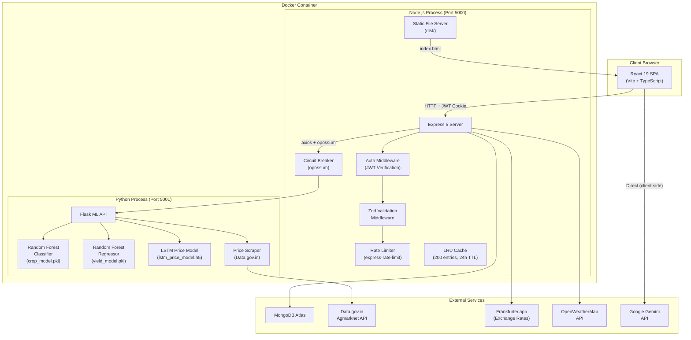
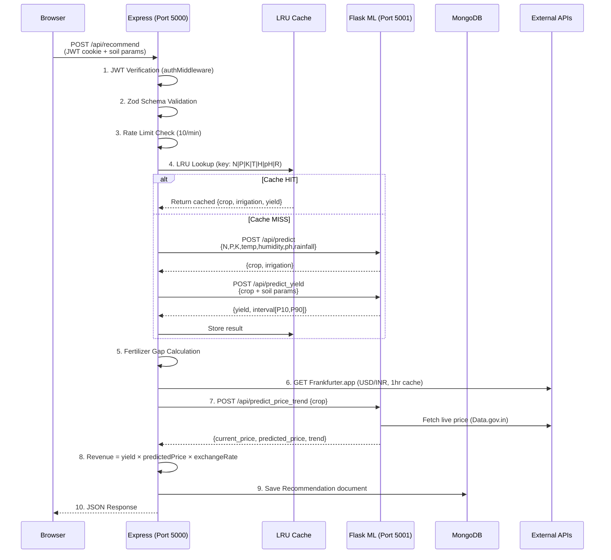
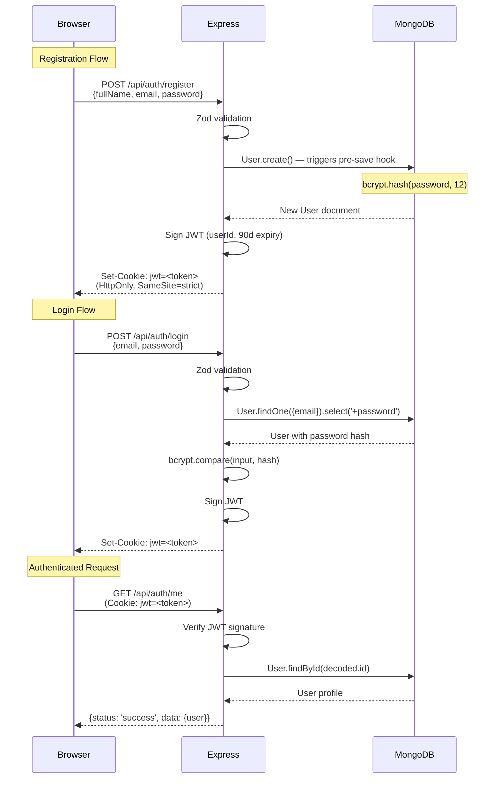
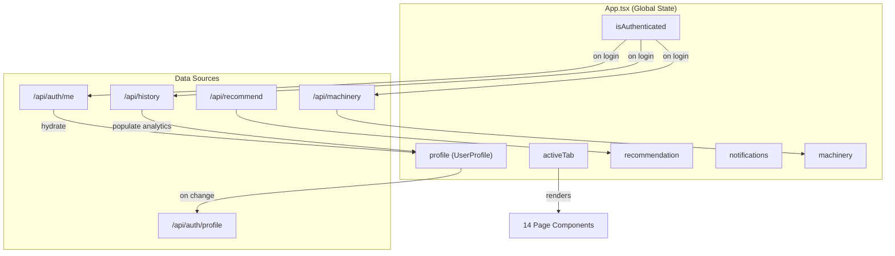
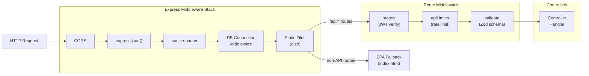
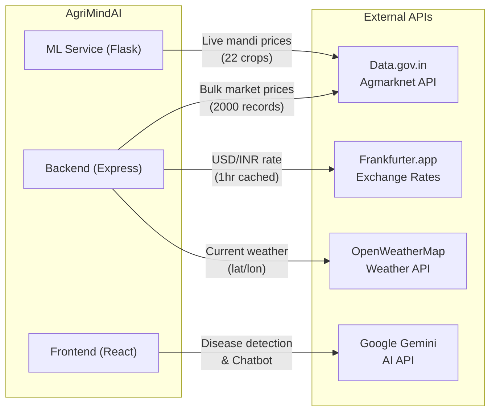

# AgriMindAI — Architecture

## Complete Architecture Overview

AgriMindAI uses a **two-service monorepo architecture** where a Node.js Express server (API gateway + SPA host) and a Python Flask ML microservice run inside a single Docker container. They communicate over localhost HTTP. MongoDB Atlas provides persistent storage.



## System Components

### 1. Frontend (React SPA)
- **Technology:** React 19, TypeScript, Vite 6, TailwindCSS 4
- **Entry Point:** [frontend/src/main.tsx](file:///c:/Users/ronad/OneDrive/Desktop/Projects/WEB+ML/AgriMindAI/frontend/src/main.tsx)
- **Root Component:** [frontend/src/App.tsx](file:///c:/Users/ronad/OneDrive/Desktop/Projects/WEB+ML/AgriMindAI/frontend/src/App.tsx) — manages global state (auth, active tab, profile, notifications)
- **Navigation:** Tab-based via `activeTab` state with `AnimatePresence` animated transitions
- **API Communication:** `fetch()` with `credentials: 'include'` (sends JWT cookie)
- **Styling:** TailwindCSS 4 with CSS custom properties for theming (dark/light mode)

### 2. Backend (Express API Gateway)
- **Technology:** Node.js, Express 5, Mongoose 9
- **Entry Point:** [backend/src/app.js](file:///c:/Users/ronad/OneDrive/Desktop/Projects/WEB+ML/AgriMindAI/backend/src/app.js)
- **Role:** API gateway, authentication, business logic, MongoDB persistence, static file serving
- **Port:** 5000

### 3. ML Service (Flask Microservice)
- **Technology:** Python 3, Flask, scikit-learn, TensorFlow/Keras
- **Entry Point:** [ml/ml_api.py](file:///c:/Users/ronad/OneDrive/Desktop/Projects/WEB+ML/AgriMindAI/ml/ml_api.py)
- **Role:** Hosts 3 ML models, serves inference endpoints
- **Port:** 5001

### 4. Database (MongoDB Atlas)
- **Technology:** MongoDB via Mongoose ODM
- **Collections:** `users`, `recommendations`, `posts`, `machineries`

---

## Folder Structure Explanation

```
AgriMindAI/
├── .env                          # Root environment variables (ML_SERVICE_URL, MongoDB, JWT, API keys)
├── .dockerignore                 # Docker build exclusions
├── .gitignore                    # Git exclusions
├── Dockerfile                    # Multi-stage Docker build (Node + Python)
├── start.sh                     # Container entrypoint (starts Flask → polls → starts Node)
├── package.json                 # Root monorepo scripts (dev, full-stack, install-all)
├── PROBLEM_STATEMENT.md         # Project problem definition
├── AgriMindAI_Project_Report.md # Comprehensive project report
│
├── backend/                     # Node.js Express API
│   ├── .env                     # Backend-specific env vars
│   ├── package.json             # Backend dependencies
│   └── src/
│       ├── app.js               # Express server entry point
│       ├── controllers/         # Route handler logic
│       │   ├── authController.js
│       │   ├── recommendController.js
│       │   ├── weatherController.js
│       │   ├── marketController.js
│       │   ├── postController.js
│       │   ├── historyController.js
│       │   └── machineryController.js
│       ├── models/              # Mongoose schemas
│       │   ├── User.js
│       │   ├── Recommendation.js
│       │   ├── Post.js
│       │   └── Machinery.js
│       ├── routes/              # Express route definitions
│       │   ├── authRoutes.js
│       │   ├── recommendRoutes.js
│       │   ├── weatherRoutes.js
│       │   ├── marketRoutes.js
│       │   ├── postRoutes.js
│       │   ├── historyRoutes.js
│       │   └── machineryRoutes.js
│       ├── middleware/          # Express middleware
│       │   ├── authMiddleware.js     # JWT verification
│       │   └── validate.js          # Zod schema validation
│       ├── validators/          # Zod schema definitions
│       │   ├── authValidators.js
│       │   ├── recommendValidators.js
│       │   ├── postValidators.js
│       │   └── weatherValidators.js
│       ├── data/                # Static lookup data
│       │   ├── cropRequirements.js   # Optimal NPK per crop
│       │   └── marketPrices.js       # Baseline USD/ton prices
│       ├── utils/
│       │   └── dbSeeder.js          # Production database seeder
│       └── scripts/
│           └── runSeed.js           # Standalone seed runner
│
├── frontend/                    # React SPA (Vite + TypeScript)
│   ├── .env                     # Frontend env (Gemini API key)
│   ├── index.html               # HTML entry point
│   ├── vite.config.ts           # Vite config (TailwindCSS, PWA, proxy)
│   ├── tsconfig.json            # TypeScript configuration
│   ├── metadata.json            # App metadata (name, description, permissions)
│   ├── package.json             # Frontend dependencies
│   └── src/
│       ├── main.tsx             # React DOM render entry
│       ├── App.tsx              # Root component (711 lines, global state)
│       ├── types.ts             # TypeScript type definitions
│       ├── i18n.ts              # Internationalization (EN + HI)
│       ├── index.css            # Global styles, CSS variables, TailwindCSS theme
│       ├── components/          # Reusable UI components
│       │   ├── SoilInputForm.tsx
│       │   ├── RecommendationCard.tsx
│       │   └── WeatherWidget.tsx
│       ├── pages/               # Feature page components
│       │   ├── AuthPage.tsx
│       │   ├── DiseaseDetection.tsx
│       │   ├── AgriCalendar.tsx
│       │   ├── InventoryManager.tsx
│       │   ├── MachineryMarketplace.tsx
│       │   ├── IrrigationScheduler.tsx
│       │   ├── YieldSimulator.tsx
│       │   ├── AgriConsultant.tsx
│       │   ├── AnalyticsDashboard.tsx
│       │   ├── MarketInsights.tsx
│       │   ├── FinancialLedger.tsx
│       │   ├── CommunityFeed.tsx
│       │   ├── NotificationCenter.tsx
│       │   └── UserProfile.tsx
│       ├── layouts/
│       │   └── Sidebar.tsx          # Navigation sidebar
│       ├── lib/
│       │   ├── utils.ts             # cn() utility (clsx + tailwind-merge)
│       │   ├── notifications.ts     # Browser push notification helpers
│       │   └── pdfExport.ts         # html2canvas + jsPDF export
│       └── utils/                   # (empty)
│
└── ml/                          # Python ML Pipeline
    ├── ml_api.py                # Flask API server (3 models)
    ├── requirements.txt         # Python dependencies
    ├── models/                  # Serialized ML artifacts
    │   ├── crop_model.pkl       # Random Forest Classifier (~3.5 MB)
    │   ├── scaler.pkl           # StandardScaler for crop model
    │   ├── label_encoder.pkl    # LabelEncoder for crop names
    │   ├── yield_model.pkl      # Random Forest Regressor (~60 MB)
    │   ├── yield_label_encoder.pkl
    │   ├── lstm_price_model.h5  # LSTM Keras model (~150 KB)
    │   ├── price_scaler.pkl     # MinMaxScaler for prices
    │   └── crop_price_history.json  # Historical 5-month price sequences
    ├── data/                    # Training/validation datasets
    │   ├── Crop_recommendation.csv
    │   ├── synthetic_yield_data.csv
    │   ├── real_world_yield_data.csv
    │   ├── grounded_yield_data.csv
    │   └── real_world_validation.csv
    ├── notebooks/               # Jupyter training notebooks
    │   ├── model_training.ipynb
    │   ├── train_price_lstm.ipynb
    │   ├── train_price_lstm.py
    │   └── train_yield_model.ipynb
    └── src/
        ├── inference/
        │   └── test_grounded_price.py
        ├── preprocessing/
        │   ├── generate_grounded_data.py
        │   ├── source_real_data.py
        │   └── calibrate_price_scaler.py
        ├── training/
        │   ├── train_yield_model.py
        │   └── validate_yield_model.py
        └── utils/
            ├── data_generator.py    # Synthetic yield data generation
            └── price_scraper.py     # Data.gov.in Agmarknet price fetcher
```

---

## Data Flow Diagrams

### Recommendation Request Lifecycle



### Authentication Flow



### State Management Flow (Frontend)



### Backend Processing Flow



### External Integrations



---

## Key Architectural Decisions

### 1. Two-Service Single-Container
The Flask ML service and Node.js API run in a single Docker container, communicating over localhost. This simplifies deployment at the cost of independent scaling. The `start.sh` entrypoint script orchestrates startup order.

### 2. Circuit Breaker Pattern
All ML service calls are wrapped in an `opossum` circuit breaker (8s timeout, 50% error threshold). Crop prediction failure returns 503; yield prediction fails gracefully with a default value. This prevents cascade failures.

### 3. Caching Strategy
- **LRU Cache:** 200 entries, 24-hour TTL for ML predictions (keyed by 7 input params)
- **Exchange Rate Cache:** 1-hour in-memory TTL
- **MongoDB Connection Cache:** Module-scope `cachedDb` for serverless compatibility

### 4. Cookie-Based JWT
JWT tokens are stored exclusively in `HttpOnly`, `SameSite: strict` cookies — never in `localStorage`. This prevents XSS-based token theft.

### 5. Frontend State Management
All state lives in `App.tsx` using React `useState` hooks. No external state management library (Redux, Zustand). State is hydrated from backend APIs on login and synced back on changes via `saveProfileToDb()`.
