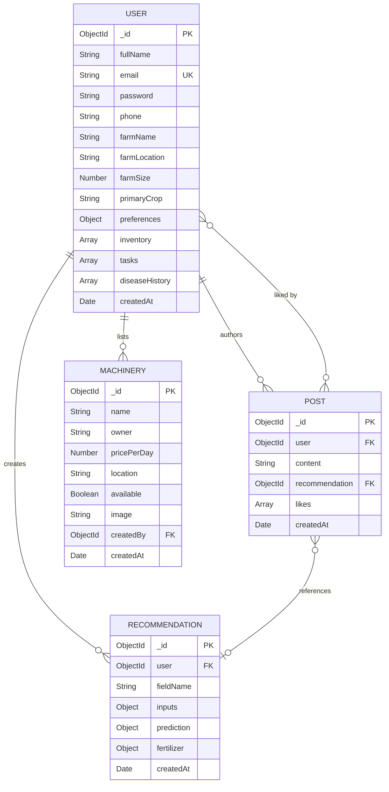
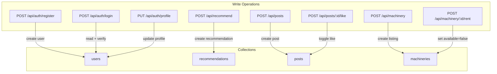
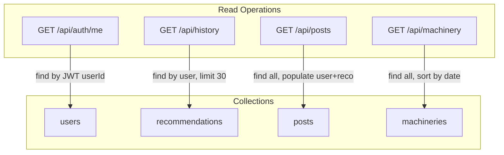

# AgriMindAI — Data Model Reference

## Database Overview

- **Database Engine:** MongoDB Atlas
- **ODM:** Mongoose 9
- **Collections:** `users`, `recommendations`, `posts`, `machineries`
- **Connection:** Cached module-scope connection in [app.js](file:///c:/Users/ronad/OneDrive/Desktop/Projects/WEB+ML/AgriMindAI/backend/src/app.js#L16-L30)

---

## Entity Relationship Diagram

---

## Collection Schemas

### 1. Users (`users`)

**Source:** [User.js](file:///c:/Users/ronad/OneDrive/Desktop/Projects/WEB+ML/AgriMindAI/backend/src/models/User.js)

| Field | Type | Required | Default | Notes |
|---|---|---|---|---|
| `fullName` | String | Yes | — | 2–50 characters |
| `email` | String | Yes | — | Unique, lowercase, valid email |
| `password` | String | Yes | — | Min 8 chars, `select: false` (hidden from queries) |
| `phone` | String | No | `'+91 98765 43210'` | — |
| `farmName` | String | No | `'Green Valley Farms'` | — |
| `farmLocation` | String | No | `'Punjab, India'` | — |
| `farmSize` | Number | No | `15.5` | In acres |
| `primaryCrop` | String | No | `'Rice'` | — |
| `preferences` | Object | No | See below | Embedded sub-schema |
| `inventory` | [Object] | No | `[]` | Array of inventory items |
| `tasks` | [Object] | No | `[]` | Array of farm tasks |
| `diseaseHistory` | [Object] | No | `[]` | Array of disease records |
| `createdAt` | Date | No | `Date.now` | Auto-generated |

#### `preferences` Sub-Schema

| Field | Type | Default | Enum |
|---|---|---|---|
| `notifications` | Boolean | `true` | — |
| `theme` | String | `'dark'` | `['light', 'dark']` |
| `currency` | String | `'INR'` | `['INR', 'USD']` |
| `language` | String | `'en'` | `['en', 'hi']` |

#### `inventory[]` Sub-Schema

| Field | Type | Required | Notes |
|---|---|---|---|
| `name` | String | Yes | — |
| `category` | String | Yes | Enum: `Seeds`, `Fertilizers`, `Pesticides`, `Tools`, `Other` |
| `quantity` | Number | Yes | Min: 0 |
| `unit` | String | Yes | — |
| `minThreshold` | Number | No | Default: 0. Triggers low-stock alert when quantity < threshold |

#### `tasks[]` Sub-Schema

| Field | Type | Required | Notes |
|---|---|---|---|
| `title` | String | Yes | — |
| `date` | String | Yes | ISO date string (YYYY-MM-DD) |
| `category` | String | No | Enum: `Irrigation`, `Fertilizer`, `Weeding`, `Harvesting`, `Disease Control`, `General` |
| `priority` | String | No | Default: `'medium'`. Enum: `low`, `medium`, `high` |
| `completed` | Boolean | No | Default: `false` |

#### `diseaseHistory[]` Sub-Schema

| Field | Type | Required | Notes |
|---|---|---|---|
| `diseaseName` | String | Yes | — |
| `date` | String | Yes | ISO date string |
| `severity` | String | No | Enum: `Low`, `Medium`, `High` |
| `crop` | String | No | — |

#### Hooks & Methods

- **Pre-save Hook:** If `password` is modified, hashes it with `bcrypt` (cost factor 12)
- **Instance Method:** `comparePassword(candidatePassword, userPassword)` — calls `bcrypt.compare()`

#### Indexes
- `email`: unique index (enforced by `unique: true`)

---

### 2. Recommendations (`recommendations`)

**Source:** [Recommendation.js](file:///c:/Users/ronad/OneDrive/Desktop/Projects/WEB+ML/AgriMindAI/backend/src/models/Recommendation.js)

| Field | Type | Required | Notes |
|---|---|---|---|
| `user` | ObjectId | Yes | References `User` collection |
| `fieldName` | String | No | Default: `'Default Field'` |
| `inputs` | Object | Yes | Soil/climate parameters |
| `prediction` | Object | Yes | ML model outputs |
| `fertilizer` | Object | No | Nutrient gap analysis |
| `createdAt` | Date | No | Default: `Date.now` |

#### `inputs` Sub-Schema

| Field | Type | Required | Notes |
|---|---|---|---|
| `N` | Number | Yes | Nitrogen (0–500) |
| `P` | Number | Yes | Phosphorus (0–500) |
| `K` | Number | Yes | Potassium (0–500) |
| `temperature` | Number | Yes | °C (-50 to 60) |
| `humidity` | Number | Yes | % (0–100) |
| `ph` | Number | Yes | pH scale (0–14) |
| `rainfall` | Number | Yes | mm (0–500) |

#### `prediction` Sub-Schema

| Field | Type | Notes |
|---|---|---|
| `crop` | String | Predicted crop name |
| `irrigation` | String | `Low`, `Medium`, or `High` |
| `yield` | Number | Tons per hectare |
| `yieldInterval` | [Number] | `[P10, P90]` confidence interval |
| `marketPrice` | Number | Current price (INR/ton or USD/ton) |
| `estimatedRevenue` | Number | yield × price |
| `marketTrend` | String | `Up`, `Down`, or `Stable` |

#### `fertilizer` Sub-Schema

| Field | Type | Notes |
|---|---|---|
| `N` | String | e.g., `"Deficit: Apply 28 kg/ha more"` or `"Optimal"` |
| `P` | String | Same format |
| `K` | String | Same format |
| `summary` | [String] | Array of human-readable advisory strings |

#### Indexes
- `user`: indexed for history queries
- `createdAt`: sorted descending for history retrieval

---

### 3. Posts (`posts`)

**Source:** [Post.js](file:///c:/Users/ronad/OneDrive/Desktop/Projects/WEB+ML/AgriMindAI/backend/src/models/Post.js)

| Field | Type | Required | Notes |
|---|---|---|---|
| `user` | ObjectId | Yes | References `User` collection |
| `content` | String | Yes | Max 500 characters |
| `recommendation` | ObjectId | No | References `Recommendation` collection |
| `likes` | [ObjectId] | No | Array of User IDs who liked. Default: `[]` |
| `createdAt` | Date | No | Default: `Date.now` |

> [!WARNING]
> There is an inconsistency: the Mongoose model limits `content` to 500 chars (`maxlength: 500`), but the Zod validator allows up to 2000 chars. The Mongoose constraint takes precedence at the database level.

---

### 4. Machineries (`machineries`)

**Source:** [Machinery.js](file:///c:/Users/ronad/OneDrive/Desktop/Projects/WEB+ML/AgriMindAI/backend/src/models/Machinery.js)

| Field | Type | Required | Notes |
|---|---|---|---|
| `name` | String | Yes | Equipment name |
| `owner` | String | Yes | Owner display name |
| `pricePerDay` | Number | Yes | Rental price in INR/day |
| `location` | String | Yes | Geographic location |
| `available` | Boolean | No | Default: `true` |
| `image` | String | No | URL to equipment photo |
| `createdBy` | ObjectId | No | References `User` collection |
| `createdAt` | Date | No | Default: `Date.now` |

---

## Data Lookup Tables (Non-Database)

### Crop Requirements

**Source:** [cropRequirements.js](file:///c:/Users/ronad/OneDrive/Desktop/Projects/WEB+ML/AgriMindAI/backend/src/data/cropRequirements.js)

Static lookup table mapping 22 crop names to their optimal NPK values (kg/ha). Used for fertilizer gap calculation.

| Field | Description |
|---|---|
| `N` | Optimal Nitrogen (kg/ha) |
| `P` | Optimal Phosphorus (kg/ha) |
| `K` | Optimal Potassium (kg/ha) |

### Market Prices

**Source:** [marketPrices.js](file:///c:/Users/ronad/OneDrive/Desktop/Projects/WEB+ML/AgriMindAI/backend/src/data/marketPrices.js)

Static baseline prices (USD/ton) for 22 crops. Used as fallback when live market data is unavailable.

### Static Mandi Prices (ML Service)

**Source:** [price_scraper.py](file:///c:/Users/ronad/OneDrive/Desktop/Projects/WEB+ML/AgriMindAI/ml/src/utils/price_scraper.py#L11-L18)

Static fallback prices (INR/ton) based on 2024 mandi averages. Used when `DATA_GOV_API_KEY` is not set.

---

## ML Model Artifacts

These are not database entities but are critical data files loaded at runtime:

| File | Format | Size | Description |
|---|---|---|---|
| `crop_model.pkl` | joblib (pickle) | ~3.5 MB | Random Forest Classifier (crop prediction) |
| `scaler.pkl` | joblib | <1 KB | StandardScaler for crop model inputs |
| `label_encoder.pkl` | joblib | <1 KB | LabelEncoder for 22 crop names |
| `yield_model.pkl` | joblib | ~60 MB | Random Forest Regressor (100 trees) |
| `yield_label_encoder.pkl` | joblib | <1 KB | LabelEncoder for yield model crop encoding |
| `lstm_price_model.h5` | Keras HDF5 | ~150 KB | LSTM neural network (5-step sequence) |
| `price_scaler.pkl` | joblib | <1 KB | MinMaxScaler for price normalization |
| `crop_price_history.json` | JSON | <10 KB | Last 5 historical price points per crop |

**Location:** [ml/models/](file:///c:/Users/ronad/OneDrive/Desktop/Projects/WEB+ML/AgriMindAI/ml/models)

---

## Data Flow: Write Paths

## Data Flow: Read Paths

