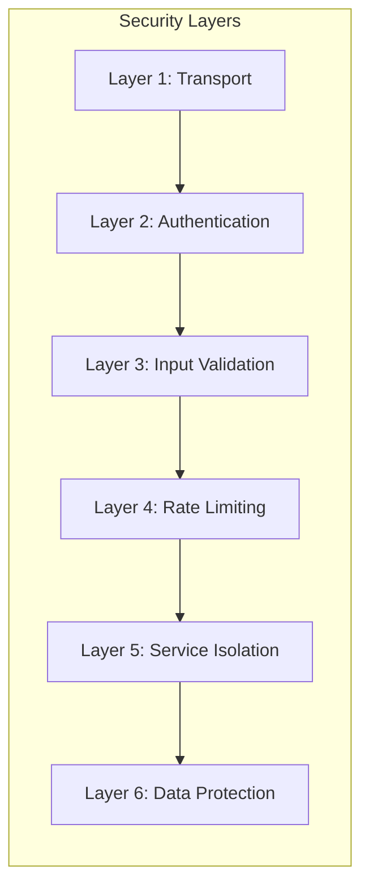

# AgriMindAI — Security Review

## Security Architecture Overview



---

## Authentication & Session Management

### Implementation

| Aspect | Implementation | Source |
|---|---|---|
| **Mechanism** | JWT (JSON Web Token) | [authController.js#L5-L15](file:///c:/Users/ronad/OneDrive/Desktop/Projects/WEB+ML/AgriMindAI/backend/src/controllers/authController.js#L5-L15) |
| **Token Storage** | `HttpOnly`, `SameSite: strict` cookie | [authController.js#L8-L14](file:///c:/Users/ronad/OneDrive/Desktop/Projects/WEB+ML/AgriMindAI/backend/src/controllers/authController.js#L8-L14) |
| **Token Expiry** | 90 days | `JWT_EXPIRES_IN` or hardcoded `'90d'` |
| **Password Hashing** | bcrypt, cost factor 12 | [User.js#L67-L73](file:///c:/Users/ronad/OneDrive/Desktop/Projects/WEB+ML/AgriMindAI/backend/src/models/User.js#L67-L73) |
| **Token Verification** | `authMiddleware.js` extracts from cookie or Bearer header | [authMiddleware.js](file:///c:/Users/ronad/OneDrive/Desktop/Projects/WEB+ML/AgriMindAI/backend/src/middleware/authMiddleware.js) |
| **Password in Queries** | `select: false` on password field — excluded from all queries by default | [User.js#L13](file:///c:/Users/ronad/OneDrive/Desktop/Projects/WEB+ML/AgriMindAI/backend/src/models/User.js#L13) |

### Strengths ✅

- **HttpOnly Cookie:** JWT is never exposed to JavaScript, preventing XSS-based token theft
- **SameSite: strict:** Prevents CSRF attacks from cross-origin requests
- **bcrypt Cost Factor 12:** Strong password hashing resistant to brute-force attacks
- **Pre-save Hook:** Passwords are automatically hashed on creation and modification — developers can't accidentally store plaintext
- **Password Hidden by Default:** `select: false` ensures passwords are never accidentally returned in API responses

### Vulnerabilities ⚠️

| Issue | Severity | Description | Recommendation |
|---|---|---|---|
| **No Refresh Token Rotation** | Medium | 90-day JWT with no rotation. If stolen, valid for 3 months. | Implement short-lived access tokens (15 min) + rotating refresh tokens |
| **Long Token Expiry** | Medium | 90-day expiry is excessively long for a security-sensitive application | Reduce to 7 days with refresh token mechanism |
| **No Token Revocation** | Medium | No mechanism to invalidate compromised tokens (no blacklist) | Add token blacklist in Redis or short-lived tokens |
| **JWT Secret Management** | Low | `JWT_SECRET` stored in `.env` file | Use a secrets manager (AWS Secrets Manager, Vault) in production |
| **No Account Lockout** | Low | No protection against credential stuffing or brute-force login attempts | Implement progressive delays or account lockout after N failed attempts |
| **No Email Verification** | Low | Users can register with any email without verification | Add email verification flow |
| **Google OAuth Non-Functional** | Info | The Google OAuth button is UI-only — no actual OAuth implementation | Either implement or remove the button |

---

## Input Validation

### Implementation

All input-accepting routes use Zod schema validation via a generic middleware:

**Source:** [validate.js](file:///c:/Users/ronad/OneDrive/Desktop/Projects/WEB+ML/AgriMindAI/backend/src/middleware/validate.js)

```javascript
// Validates req.body, req.params, and req.query independently
const validate = (schema) => (req, res, next) => {
  const result = schema.safeParse({
    body: req.body,
    params: req.params,
    query: req.query
  });
  // Returns 400 with detailed error messages on failure
};
```

### Validated Routes

| Route | Schema | Validated Fields |
|---|---|---|
| `POST /api/auth/register` | `registerSchema` | fullName (2-50), email (valid), password (min 8) |
| `POST /api/auth/login` | `loginSchema` | email (valid), password (min 1) |
| `POST /api/recommend` | `recommendSchema` | N,P,K (0-500), temp (-50-60), humidity (0-100), pH (0-14), rainfall (0-500) |
| `POST /api/posts` | `createPostSchema` | content (1-2000), recommendation (optional ObjectId) |
| `POST /api/posts/:id/like` | `likePostSchema` | id (24-char hex ObjectId) |
| `GET /api/weather` | `weatherSchema` | lat (-90-90), lon (-180-180) |

### Strengths ✅

- **Zod for Type Safety:** Schemas provide runtime type checking and coercion
- **Centralized Validation:** Single middleware handles all routes consistently
- **Detailed Error Messages:** Returns specific field-level errors
- **Range Constraints:** Numeric inputs bounded to realistic ranges
- **ObjectId Validation:** MongoDB IDs validated as 24-char hex strings

### Vulnerabilities ⚠️

| Issue | Severity | Description | Recommendation |
|---|---|---|---|
| **Post Content Length Mismatch** | Low | Zod allows 2000 chars, Mongoose model limits to 500 | Align limits (change Zod to 500 or Mongoose to 2000) |
| **No Sanitization** | Low | Input is validated for type/range but not sanitized for HTML/XSS | Add output encoding or input sanitization for user-generated content |
| **Missing Validation on Some Routes** | Low | `POST /api/machinery` and `PUT /api/auth/profile` lack Zod validation | Add validation schemas for these routes |

---

## Rate Limiting

### Implementation

**Source:** [recommendRoutes.js](file:///c:/Users/ronad/OneDrive/Desktop/Projects/WEB+ML/AgriMindAI/backend/src/routes/recommendRoutes.js)

| Configuration | Value |
|---|---|
| **Library** | `express-rate-limit` |
| **Window** | 60 seconds |
| **Max Requests** | 10 per IP per window |
| **Applied To** | `POST /api/recommend` only |

### Strengths ✅

- Prevents abuse of the computationally expensive ML prediction endpoint
- Returns standard 429 Too Many Requests response

### Vulnerabilities ⚠️

| Issue | Severity | Description | Recommendation |
|---|---|---|---|
| **Limited Scope** | Medium | Only applied to `/api/recommend`. Auth endpoints are unprotected. | Add rate limiting to `/api/auth/login` (prevent brute-force) |
| **IP-Based Only** | Low | Can be bypassed with rotating IPs or behind a proxy | Consider user-based rate limiting for authenticated routes |

---

## Service Isolation & Resilience

### Circuit Breaker

**Source:** [recommendController.js#L18-L24](file:///c:/Users/ronad/OneDrive/Desktop/Projects/WEB+ML/AgriMindAI/backend/src/controllers/recommendController.js#L18-L24)

| Parameter | Value | Purpose |
|---|---|---|
| `timeout` | 8,000 ms | Max time per ML call |
| `errorThresholdPercentage` | 50 | Open circuit when 50% of calls fail |
| `resetTimeout` | 30,000 ms | Time before attempting to close circuit |
| `volumeThreshold` | 3 | Min calls before opening circuit |

### Internal Communication

- Flask ML service runs on `localhost:5001` — not exposed to external network
- Communication via `axios` HTTP calls (no raw socket)
- Circuit breaker prevents cascading failures

### Strengths ✅

- ML service is network-isolated (localhost only)
- Circuit breaker prevents resource exhaustion from hanging ML calls
- Separate fallback strategies for critical (crop prediction) vs. non-critical (yield) calls

---

## Data Protection

### Sensitive Data Handling

| Data Type | Protection | Storage |
|---|---|---|
| **Passwords** | bcrypt hash (cost 12) | MongoDB `users.password` (select: false) |
| **JWT Token** | HttpOnly + SameSite cookie | Browser cookie |
| **API Keys** | Environment variables | `.env` files |
| **User Profile** | JWT-protected read/write | MongoDB `users` |
| **Recommendation Data** | JWT-protected, linked to user | MongoDB `recommendations` |

### Strengths ✅

- Passwords never returned in API responses (`select: false`)
- API keys stored in environment variables, not in code
- User data access requires valid JWT

### Vulnerabilities ⚠️

| Issue | Severity | Description | Recommendation |
|---|---|---|---|
| **No HTTPS Enforcement** | High | Application runs on HTTP. Cookies, JWT, and passwords sent in cleartext. | Enable HTTPS in production (TLS termination at load balancer) |
| **CORS: All Origins** | Medium | CORS is configured but may accept all origins | Whitelist specific frontend domains in production |
| **`.env` Files in Repo** | Medium | `.env` files may contain secrets and could be committed to git | Ensure `.env` is in `.gitignore`, use secrets manager |
| **No Data Encryption at Rest** | Low | MongoDB data is not encrypted at rest (depends on Atlas configuration) | Enable encryption at rest in MongoDB Atlas |
| **No Audit Logging** | Low | No logging of authentication events, permission changes, or data access | Add structured audit logging |
| **Profile Photo URL from picsum.photos** | Info | User avatar loaded from external CDN without integrity check | Use local/controlled avatar storage |

---

## Dependency Security

### Node.js Dependencies (Key)

| Package | Version | Risk Notes |
|---|---|---|
| `express` | 5.x | Pre-release version — may have undiscovered vulnerabilities |
| `jsonwebtoken` | Latest | Well-maintained, widely audited |
| `bcryptjs` | Latest | Pure JS bcrypt — secure but slower than native binding |
| `mongoose` | 9.x | Recent major version — verify migration notes |
| `axios` | Latest | HTTP client — ensure no SSRF patterns |
| `opossum` | Latest | Circuit breaker — no known security issues |

### Python Dependencies (Key)

| Package | Version | Risk Notes |
|---|---|---|
| `flask` | Latest | Ensure debug mode is off in production |
| `tensorflow` | Latest | Large dependency surface — keep updated |
| `requests` | Latest | HTTP client for price scraping |

### Recommendations

- [ ] Run `npm audit` regularly
- [ ] Run `pip audit` or `safety check` for Python dependencies
- [ ] Pin dependency versions in production
- [ ] Consider using `express@4` (stable) instead of `express@5` (pre-release)

---

## Summary: Security Posture

### What's Done Well ✅
1. HttpOnly + SameSite cookie for JWT (XSS/CSRF protection)
2. bcrypt password hashing with cost factor 12
3. Zod schema validation on critical routes
4. Rate limiting on ML endpoint
5. Circuit breaker for ML service isolation
6. Password excluded from queries by default
7. ML service not exposed externally

### What Needs Improvement 🔧
1. **HTTPS:** Must be enabled in production
2. **Token Lifecycle:** Implement refresh token rotation, reduce 90-day expiry
3. **Rate Limiting Scope:** Extend to auth and all write endpoints
4. **CORS Whitelist:** Restrict allowed origins in production
5. **Input Sanitization:** Add HTML/XSS sanitization for user-generated content
6. **Audit Logging:** Add structured logging for security events
7. **Dependency Pinning:** Pin versions and audit regularly
