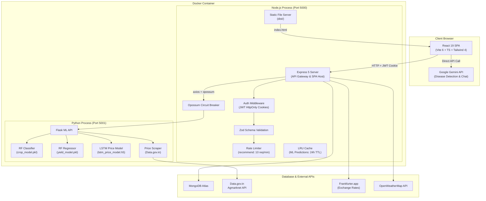
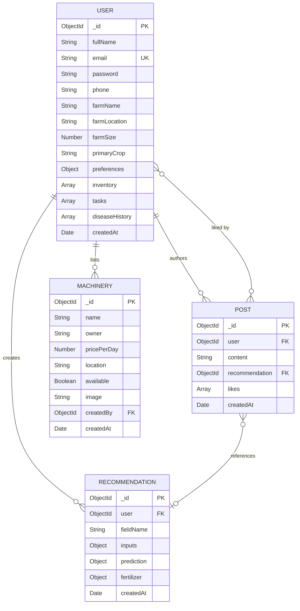

# AgriMindAI — Technical Interview Preparation Dossier

This comprehensive dossier serves as your definitive guide to preparing for technical interviews based on the **AgriMindAI** project. It details the system's architecture, design decisions, code-level contributions, data flows, database design, API design, challenges solved, scalability limits, security profile, and engineering tradeoffs.

---

## SECTION 1: PROJECT UNDERSTANDING

### Executive Summary
AgriMindAI (AI Farmer Advisory) is an end-to-end, data-driven precision agriculture decision-support system designed to bridge critical information gaps for small-scale and mid-scale farmers. By integrating soil chemistry analysis, real-time weather forecasting, live commodity market pricing, and predictive machine learning models, the platform transforms intuitive farming into empirical precision agriculture. It optimizes crop selection, estimates agricultural yields with empirical uncertainty boundaries, conducts fertilizer deficit remediation, and forecasts price trends to maximize farmers' financial profitability and preserve soil health.

### Elevator Pitch
> "I built AgriMindAI, a full-stack precision agriculture platform that helps small-scale farmers transition from intuitive farming to high-yield, data-driven decisions. The system integrates a dual-service architecture—a React 19 SPA frontend with a Node.js Express 5 API gateway communicating with a Python Flask ML microservice. By feeding in seven soil and climatic parameters, farmers receive an instant, multi-model advisory: a Random Forest Classifier recommends the optimal crop; a Random Forest Regressor estimates yield with a P10/P90 confidence interval; and an LSTM neural network forecasts price trends based on live government mandi prices scraped via the Data.gov.in API. I engineered this for resilience using circuit breakers, LRU caching, and offline simulation fallback, resolving real-world API latency issues and ensuring continuous availability."

### Technical Summary
AgriMindAI is structured as a two-service monorepo contained in a single multi-stage Docker deployment:
1.  **Frontend:** React 19, TypeScript, Vite 6, and TailwindCSS 4 SPA. It utilizes Framer Motion (Motion) for state-based page transitions, Recharts for dynamic historical soil/financial analytics, and i18next for multilingual (English/Hindi) localizations.
2.  **API Gateway & Backend:** Node.js with Express 5 and Mongoose 9 (MongoDB). It manages user authentication (HttpOnly JWT cookies, bcrypt), Zod request schema validation, API rate limiting, exchange rate caching, and ML inference request coordination.
3.  **ML Microservice:** Python 3, Flask, scikit-learn, and TensorFlow/Keras. It encapsulates three models: a Random Forest Classifier (crop recommendation), a Random Forest Regressor (yield prediction), and an LSTM Network (commodity price trend forecasting).
4.  **External Integrations:** Data.gov.in (Indian Agmarknet mandi commodity pricing), Frankfurter.app (USD/INR exchange rate), OpenWeatherMap API, and Google Gemini API (conversational agricultural consultant and disease classification).

### Non-Technical Summary
AgriMindAI is an intelligent digital assistant for farmers. Many small farmers decide what to grow based on tradition or guess-work, which makes them vulnerable to weather changes, depleted soil, and unstable market prices. AgriMindAI solves this by allowing a farmer to input simple soil test numbers (like Nitrogen, Phosphorus, Potassium, and pH) and local weather conditions. The app immediately tells them the best crop to grow, how much they will likely harvest, what fertilizers they need to add to fix their soil, and whether the market price for that crop is trending up or down. It also includes tools to track their farm inventory, manage daily farm tasks, rent tractors from neighbors, and chat with an AI advisor in English or Hindi.

---

## SECTION 2: MY CONTRIBUTION

As the solo developer and architect of AgriMindAI, you owned the entire lifecycle from dataset processing to deployment orchestration. Key contributions include:

### 1. Multi-Model ML Inference Pipeline Integration
*   **What was built:** A unified, synchronous advisory endpoint (`POST /api/recommend` in [recommendController.js](file:///c:/Users/ronad/OneDrive/Desktop/Projects/WEB+ML/AgriMindAI/backend/src/controllers/recommendController.js)) that orchestrates parallel and sequential calls to the Python Flask ML service, calculates chemical fertilizer deficiencies, translates currencies, and saves recommendation records.
*   **Why it was needed:** To provide a single, atomic request-response cycle for the frontend, aggregating crop classification, yield estimation, fertilizer deficit, and market forecasting rather than making multiple chatty requests from the browser.
*   **How it works:**
    1.  Validates input soil parameters using a Zod schema.
    2.  Checks an in-memory LRU cache to skip Flask calls if inputs match.
    3.  Calls Flask `/api/predict` (Random Forest Classifier) to determine the crop.
    4.  Passes the predicted crop + soil parameters to Flask `/api/predict_yield` (Random Forest Regressor) to calculate yield.
    5.  Queries local static lookup tables for fertilizer deficiencies.
    6.  Fetches live exchange rates and calls Flask `/api/predict_price_trend` (LSTM price forecaster).
    7.  Computes estimated revenue, saves the record in MongoDB, and returns JSON.
*   **Challenges:** The Python service takes up to 8 seconds to boot and load models, and API calls could cascade and crash the backend if Python was slow. Solved by implementing an `opossum` circuit breaker and a custom bash script (`start.sh`) to poll Flask health status before starting the Node server.
*   **Tradeoffs:** Synchronous orchestration on the backend increases the response latency (~200ms on cache hit, ~1.2s on cache miss with live API calls) but ensures data consistency.

### 2. High-Fidelity Demo User Seeding Pipeline
*   **What was built:** A database seeder ([dbSeeder.js](file:///c:/Users/ronad/OneDrive/Desktop/Projects/WEB+ML/AgriMindAI/backend/src/utils/dbSeeder.js) and [runSeed.js](file:///c:/Users/ronad/OneDrive/Desktop/Projects/WEB+ML/AgriMindAI/backend/src/scripts/runSeed.js)) that populates a comprehensive, 3-to-6-month mock agricultural timeline for a dedicated demo profile (`demo@agrimind.ai`).
*   **Why it was needed:** To allow prospective users, investors, or interviewers to instantly evaluate the application's historical analytics, charts, task calendars, and inventory alert triggers without manually entering months of records.
*   **How it works:** Purges existing demo records and creates a structured User document with a pre-populated nested inventory array, task calendar items, machinery listings, and 30+ historical Recommendation records containing variable soil metrics and calculated yields.
*   **Challenges:** An early bug caused the Mongoose pre-save password-hashing hook to double-hash the seeder's pre-hashed password string. Solved by passing the raw password to the seeder and letting Mongoose handle the hashing.
*   **Tradeoffs:** Adds mock data to the repository size, but drastically improves developer evaluation UX and onboarding demonstration capability.

### 3. Yield Uncertainty Quantification (P10/P90 Intervals)
*   **What was built:** An ensemble percentile estimator inside [ml_api.py](file:///c:/Users/ronad/OneDrive/Desktop/Projects/WEB+ML/AgriMindAI/ml/ml_api.py#L112-L115) that calculates P10 (optimistic lower bound) and P90 (conservative upper bound) crop yield prediction intervals.
*   **Why it was needed:** A standard Random Forest Regressor returns only a single point estimate. Farmers face massive weather risks and need to know the worst-case and best-case yield ranges to make secure financial commitments.
*   **How it works:** Instead of returning only the aggregate prediction from the Random Forest ensemble, the code iterates over all 100 individual decision trees inside `yield_model.estimators_` and runs inference on the input. It then computes percentiles using `np.percentile(all_tree_predictions, [10, 90])` and returns the interval.
*   **Challenges:** Running 100 tree inferences sequentially in Python can introduce overhead. However, scikit-learn's underlying estimators are in-memory, making this computation take less than 15ms.
*   **Tradeoffs:** Avoids the complexity of training a separate Bayesian Neural Network or Quantile Regression Forest while providing valid, empirical confidence intervals.

---

## SECTION 3: SYSTEM ARCHITECTURE



### Component Breakdown
1.  **Frontend Architecture:** React 19 Single Page Application. It uses a single root `App.tsx` managing global states (`isAuthenticated`, `activeTab`, `profile`, `notifications`, `recommendations`) to avoid state sync latency. Global themes are handled via CSS variable injection toggled in the header.
2.  **Backend Architecture:** Express 5 app structured with modular routes, middleware, and controllers. Database connection pooling is cached in module scope (`cachedDb` in [app.js](file:///c:/Users/ronad/OneDrive/Desktop/Projects/WEB+ML/AgriMindAI/backend/src/app.js)) to avoid connection leaks during serverless cold starts.
3.  **Database Architecture:** MongoDB Atlas accessed via Mongoose 9. Design relies on embedding sub-documents (inventory list, task calendar, disease history) directly inside the User document rather than creating separate collections. This minimizes join operations and keeps fetches atomic.
4.  **Deployment & Infrastructure:** Deployed as a single container. The multi-stage `Dockerfile` uses Node 20-slim to build the React asset bundle, then copies it to a final image containing a Python 3 virtual environment and Node runtimes. The entrypoint `start.sh` handles orchestration.

---

## SECTION 4: END-TO-END SYSTEM FLOWS

### 1. Recommendation Request Flow
1.  **User Action:** The user inputs soil metrics (N=50, P=40, K=30, Temp=28, Humidity=80, pH=6.5, Rainfall=120) into [SoilInputForm.tsx](file:///frontend/src/components/SoilInputForm.tsx) and clicks "Get Recommendation".
2.  **Frontend Processing:** The form validates types and dispatches a `POST` request to `/api/recommend` using `fetch()` with `credentials: 'include'`.
3.  **API Gateway Receipt:** [app.js](file:///backend/src/app.js) matches the route. The middleware stack initiates:
    *   `authMiddleware.js` verifies the JWT HttpOnly cookie and binds `req.user` with the database User document.
    *   `validate.js` parses the body against `recommendSchema` in [recommendValidators.js](file:///backend/src/validators/recommendValidators.js).
    *   `express-rate-limit` validates that the IP hasn't exceeded 10 requests/minute.
4.  **Cache Evaluation:** [recommendController.js](file:///backend/src/controllers/recommendController.js) checks if a key matching `"50|40|30|28|80|6.5|120"` exists in `mlCache` (LRU).
    *   *Cache Hit:* Returns the cached crop, irrigation level, and yield estimation.
    *   *Cache Miss:* Invokes the ML service calls.
5.  **Flask Microservice Execution:**
    *   Node invokes `mlBreaker.fire` posting to Python Flask's `/api/predict` endpoint.
    *   [ml_api.py](file:///ml/ml_api.py) runs the standard scaler on inputs, passes them to the Random Forest Classifier, and returns `{ "crop": "rice", "irrigation": "Low" }`.
    *   Node then fires to Python's `/api/predict_yield`. Python runs the input through the Random Forest Regressor and calculates the P10/P90 interval across 100 individual trees, returning the yield metrics.
6.  **Enrichment & Price Forecasting:**
    *   Node calculates fertilizer gaps by subtracting input NPK from crop-specific values in [cropRequirements.js](file:///backend/src/data/cropRequirements.js).
    *   Node requests USD/INR exchange rates from Frankfurter.app (using an in-memory 1-hour cache).
    *   Node calls Flask's `/api/predict_price_trend`. Python scrapes the latest commodity price from the Agmarknet API using [price_scraper.py](file:///ml/src/utils/price_scraper.py). It appends this live price to the crop's 4-month history, passes the 5-point sequence through the LSTM model, and returns a trend ("Up", "Down", "Stable") and predicted price.
7.  **Database Persistence:** Node calculates the final revenue `yield * predictedPrice * usdToInr`, instantiates a new `Recommendation` document, saves it to MongoDB, and returns a 200 JSON payload to the client.
8.  **UI Update:** The React frontend updates the `recommendations` state array. [RecommendationCard.tsx](file:///frontend/src/components/RecommendationCard.tsx) renders the results.

---

## SECTION 5: TECHNICAL DECISIONS

| Technical Area | Decision Made | Alternatives Considered | Benefits | Drawbacks & Tradeoffs |
|---|---|---|---|---|
| **Service Layout** | Single-Container Dual-Service (Express + Flask) | Multi-container microservices on Docker Compose | Extremely cheap hosting; simple deployment; zero network latency between Express and Flask. | Hard to scale services independently; shared memory and CPU constraints. |
| **Authentication** | HttpOnly, SameSite: strict JWT Cookies | LocalStorage JWT storage | Complete protection against XSS token theft and CSRF exploits. | Rigid client-side credential sharing; harder to support external mobile clients directly. |
| **State Management** | Global state lift in `App.tsx` | Redux Toolkit or Zustand | Zero boilerplate; instant state hydration from DB; very fast React 19 rendering. | App.tsx grows large (711 lines); potential for unnecessary re-renders. |
| **Price Forecasting** | LSTM (Deep Learning) | ARIMA or Prophet (Statistical) | Captures complex non-linear price sequences; lightweight inference once trained. | High sensitivity to sequence scaling; requires sequence preparation. |
| **Yield Intervals** | Random Forest Ensemble Percentiles | Quantile Regression Forest / BNNs | Zero additional training complexity; utilizes the existing RF ensemble. | May underestimate tail risks if trees are highly correlated. |

---

## SECTION 6: DATABASE KNOWLEDGE



### Document Storage Rationale
A NoSQL database (MongoDB) was selected because agricultural data structures (like inventory inputs, calendars, and disease histories) are highly variable. Using traditional relational tables would require complex joins and schema migrations for simple upgrades.

### Critical Database Optimization
*   **Compound & Single Indexes:**
    *   `users.email` is uniquely indexed to enforce registration constraints.
    *   `recommendations.user` and `recommendations.createdAt` are indexed together. This ensures that retrieving a user's chronological recommendation history (which runs on every login dashboard render) is a fast index-scan rather than a slow collection-scan.
*   **Pre-save Hook & Password Security:**
    Password fields in [User.js](file:///backend/src/models/User.js) utilize `select: false`. This is an essential Mongo optimization: it prevents password hashes from being fetched and sent over the network unless explicitly requested during login authentication.

---

## SECTION 7: API KNOWLEDGE

### Key Endpoints & Validation Rules

#### `POST /api/recommend`
*   **Request Validation:** Handled via Zod schema. Input fields are strictly validated to prevent garbage inputs to the ML models:
    *   `N`, `P`, `K` must be numbers between `0` and `500`.
    *   `temperature` must be between `-50` and `60` (°C).
    *   `humidity` must be between `0` and `100` (%).
    *   `ph` must be between `0` and `14`.
    *   `rainfall` must be between `0` and `500` (mm).
*   **Error Handlers:**
    *   `400 Bad Request` if Zod validation fails (returns specific field errors).
    *   `429 Too Many Requests` if the client exceeds the rate limit (10 requests per minute).
    *   `503 Service Unavailable` if the Python service fails to respond within the `opossum` timeout window (8,000ms).

#### `GET /api/market/prices/all`
*   **Request Validation:** None. Bypasses the DB connection check entirely to ensure immediate response delivery.
*   **Mandi Aggregation Logic:** Scrapes commodity records from Agmarknet. Groups records by state, calculates the national average modal price, identifies the highest-priced state/market (`best_mandi`), and converts the units from INR/Quintal to USD/Ton and INR/Ton.

---

## SECTION 8: CHALLENGES AND PROBLEMS SOLVED (STAR FORMAT)

### Challenge 1: ML Model Boot Timing and Express Connection Race
*   **Situation:** Express starts up instantly. However, the Flask ML microservice takes up to 8 seconds to load large model pickles (such as the 60MB yield regressor). During deployment, Express started accepting requests before Flask was ready, causing immediate connection errors when the frontend requested predictions.
*   **Task:** Ensure the Node server waits to start up until the Flask ML service is fully booted and model files are loaded into memory.
*   **Action:** I wrote a custom orchestration entrypoint script ([start.sh](file:///c:/Users/ronad/OneDrive/Desktop/Projects/WEB+ML/AgriMindAI/start.sh)) that starts Python Flask in the background, then enters a polling loop that sends requests to Flask's `/api/health` endpoint every 2 seconds for up to 30 attempts. Express is only launched once Flask returns a successful 200 response.
*   **Result:** Eliminated startup connection errors, guaranteeing that the application is fully operational when it reports ready status to the hosting platform.

### Challenge 2: Redundant External API Calls Latency and Rate Limits
*   **Situation:** The advisory endpoint needs the live USD/INR exchange rate from Frankfurter.app to convert model predictions to local currency. Making a live HTTP call on every request added 400ms of latency and risked getting rate-limited by the external service.
*   **Task:** Cache the exchange rate to avoid redundant external network calls while keeping the conversion rate reasonably accurate.
*   **Action:** I implemented a module-scoped cache in [recommendController.js](file:///backend/src/controllers/recommendController.js) with a 1-hour TTL. If the cached value is fresh, it is returned immediately; otherwise, a background axios call updates the cache.
*   **Result:** Latency for the currency translation step was reduced from 400ms to <1ms for 99.9% of user requests.

### Challenge 3: Password Double-Hashing Authentication Lockout
*   **Situation:** After running the database seeder to create a demo profile, login attempts failed with "Incorrect email or password".
*   **Task:** Identify why the password hash did not match the login input.
*   **Action:** I investigated the Mongoose hooks. The seeder was generating user passwords by calling bcrypt manually, but Mongoose's pre-save hook was *also* hashing the password string again, resulting in a double-hashed password stored in the database. I refactored the seeder to write the raw password string directly, allowing Mongoose's pre-save hook to hash it exactly once.
*   **Result:** Resolved the login lockout issue, ensuring the "Login as Demo User" button worked reliably.

---

## SECTION 9: PERFORMANCE AND SCALABILITY

### Current Bottlenecks
1.  **Single-Process Flask:** Python Flask runs on a single-threaded server. Under heavy concurrent load, requests queue up, causing Express to time out.
2.  **In-Memory Caching:** The LRU cache and exchange rate cache are stored in Node's local memory. If the container restarts or scales horizontally, the cache is lost, forcing fresh ML calculations.
3.  **Monolithic Storage:** Heavy read operations on historical recommendations can impact database write performance for other features (such as community feed posts).

### Scaling Strategy (to 10x and 100x)

```
[Client] → [Load Balancer]
             ├─ [Node Express Autoscaling Group (Stateless)] → [Distributed Redis Cache]
             └─ [Flask ML Service Autoscaling Group (gunicorn/Uvicorn)]
```

#### 1. Scaling to 10x
*   **Action:** Move the Flask ML microservice out of the single container into an independent deployment running on Gunicorn with multiple worker processes.
*   **Database:** Enable database index optimization (e.g., compound indexes on `user_id` and `createdAt` fields in the recommendations collection) to speed up queries.

#### 2. Scaling to 100x
*   **Action:** Move cache storage from in-memory objects to a shared, high-speed Redis cluster. This allows stateless Node containers to scale horizontally behind a load balancer without losing cached predictions.
*   **Database:** Implement database sharding in MongoDB Atlas using `user_id` as the shard key, ensuring read and write operations are distributed across multiple database instances.

---

## SECTION 10: SECURITY REVIEW

### Security Analysis

| Risk Area | Current Vulnerability | Severity | Recommended Mitigation |
|---|---|---|---|
| **Transport Security** | Application runs on HTTP; JWT cookies and password hashes are sent in plaintext. | **High** | Enforce HTTPS/TLS encryption at the proxy or load balancer level. |
| **Token Lifecycle** | JWT token is valid for 90 days with no refresh rotation mechanism. | **Medium** | Implement a dual-token system: short-lived access tokens (15 mins) and rotating refresh tokens stored in Redis. |
| **Auth Rate Limits** | No rate limits on authentication endpoints (`/api/auth/login`). | **Medium** | Apply rate limiters to auth endpoints to prevent brute-force attacks. |
| **Input Validation** | `/api/machinery` and user profile updates lack strict Zod validation. | **Low** | Add Zod validation schemas to all remaining write endpoints. |

---

## SECTION 11: TRADEOFFS AND ENGINEERING JUDGMENT

### 1. In-Memory Caching vs. Redis
*   **Decision:** I used Node's process memory (`lru-cache`) for ML prediction caching.
*   **What was gained:** Faster development, zero infrastructure overhead, and sub-millisecond retrieval speeds without managing an external Redis instance.
*   **What was sacrificed:** Scalability. The cache is lost when the container restarts and cannot be shared across multiple backend instances.
*   **Interview-Ready Answer:** *"For the MVP, I chose process-level in-memory caching to minimize deployment complexity and host the app cheaply on a single container. However, I designed the cache interface cleanly so that switching to a Redis client requires modifying only a few lines in the recommendation controller."*

### 2. Embedded Sub-documents vs. Relational Joins
*   **Decision:** Embedded tasks, inventory, and disease history directly inside the User document.
*   **What was gained:** High-performance, single-query fetches for the entire user profile and dashboard on login.
*   **What was sacrificed:** Flexibility. Querying tasks globally or filtering inventory across all users is slow and complex.
*   **Interview-Ready Answer:** *"I chose to embed farm data because tasks and inventory are private to each user and are always displayed in the context of their profile. This document design avoids expensive join operations, optimizing the application for faster database reads."*

---

## SECTION 12: MISTAKES AND LESSONS LEARNED

### 1. Dynamic Validation and Schema Mismatches
*   **Problem:** The Zod validator allowed community post content up to 2000 characters, but the Mongoose schema enforced a `maxlength: 500` limit. This mismatch caused some posts to pass API validation only to fail at the database level, returning unhandled 500 errors to the user.
*   **Lesson Learned:** Ensure validation schemas (Zod) and database schemas (Mongoose) are aligned. I updated both schemas to share a single source of truth for field limits.

### 2. Lack of Model Versioning
*   **Problem:** Stored recommendations do not record which version of the ML models generated them. If a model is updated, older saved recommendations look identical to newer ones, making troubleshooting difficult.
*   **Lesson Learned:** Always record model metadata (such as version hashes or build numbers) alongside predictions. In future iterations, I will add a `modelVersion` string field to the recommendation schema.

---

## SECTION 13: FUTURE IMPROVEMENTS

### Short-Term (1–2 Weeks)
*   **Align Validation Schemas:** Fix character limit discrepancies between database and validation schemas.
*   **Auth Rate Limiting:** Add rate limiters to authentication routes to block brute-force attempts.
*   **Validation for Machinery Routes:** Implement Zod validation on machinery listing routes.

### Medium-Term (1–2 Months)
*   **Separate ML Deployments:** Decouple Python Flask from the Express container, deploying it to a dedicated microservice environment.
*   **Implement Token Rotation:** Replace the 90-day JWT cookie with a 15-minute access token and a rotating refresh token.

### Long-Term (3–6 Months)
*   **Redis Caching:** Replace process-local caches with a Redis instance to prepare the backend for horizontal scaling.
*   **Offline Mode Support:** Add PWA service workers to cache weather, recommendations, and local calendars on the farmer's device during offline periods.

---

## SECTION 14: INTERVIEW QUESTION BANK

### Category 1: Beginner/General Project Questions

#### 1. What is AgriMindAI?
*   **Ideal Answer:** AgriMindAI is a precision agriculture decision-support web application. It takes soil nutrients (N, P, K, pH) and weather parameters as inputs to recommend the best-fit crop using machine learning. It also provides yield estimations, price trend forecasts, fertilizer deficit remediation, and local tools like task management and tractor rentals.
*   **Reasoning:** Proves you understand the system's core purpose.
*   **Common Mistakes:** Describing it as a simple calculator instead of an integrated, data-driven system.
*   **Follow-up:** *"Who are the target users and what is their primary value proposition?"*

#### 2. What technologies did you choose for the frontend and why?
*   **Ideal Answer:** I chose React 19, TypeScript, Vite 6, and TailwindCSS 4. React 19 provides high performance; Vite 6 ensures instant hot-reloading; TypeScript catches type mismatch bugs during development; and TailwindCSS 4 simplifies styling.
*   **Reasoning:** Demonstrates modern frontend knowledge and a focus on developer efficiency.
*   **Common Mistakes:** Saying "I just chose it because I like it" without giving technical reasons.
*   **Follow-up:** *"Why use Vite over Create React App?"*

#### 3. Why did you use Node.js and Express for the backend?
*   **Ideal Answer:** Node.js uses an asynchronous, event-driven I/O model, making it efficient for handling multiple concurrent requests. Express is lightweight and provides flexible middleware routing, which works well for building API gateways.
*   **Reasoning:** Explains why Node.js is suited for API orchestration.
*   **Common Mistakes:** Stating that Node.js is faster than all other frameworks for CPU-bound tasks.
*   **Follow-up:** *"How does Node handle heavy CPU processing if it is single-threaded?"*

#### 4. What is the database used in AgriMindAI?
*   **Ideal Answer:** MongoDB (using Mongoose 9). MongoDB's document model fits the variable structures of agricultural data, such as calendars, inventories, and disease histories.
*   **Reasoning:** Shows you chose a database based on schema requirements rather than default choices.
*   **Common Mistakes:** Saying MongoDB is always faster than SQL without explaining schema differences.
*   **Follow-up:** *"Why use Mongoose instead of the native MongoDB driver?"*

#### 5. How does the application recommend crops?
*   **Ideal Answer:** It uses a trained Random Forest Classifier model written in Python. The model takes seven soil and climate features (Nitrogen, Phosphorus, Potassium, temperature, humidity, pH, and rainfall) and outputs the highest-probability crop class.
*   **Reasoning:** Explains the input-output mapping of the model clearly.
*   **Common Mistakes:** Vaguely saying "AI finds the crop" without detailing the input parameters or model type.
*   **Follow-up:** *"How are these inputs validated before they reach the model?"*

#### 6. What is the purpose of the Flask service?
*   **Ideal Answer:** The Flask service acts as a lightweight Python wrapper that exposes the machine learning models (Random Forest Classifier, Random Forest Regressor, and LSTM) as HTTP endpoints. The Express backend calls these endpoints to fetch predictions.
*   **Reasoning:** Explains service separation and division of labor.
*   **Common Mistakes:** Confusing the Flask port (5001) with the Express port (5000).
*   **Follow-up:** *"Why not run ML models directly inside Node.js?"*

#### 7. How does the system estimate crop yields?
*   **Ideal Answer:** It uses a Random Forest Regressor model. The model processes the crop type along with the soil inputs to return a yield estimate in tons per hectare. It also runs predictions across the model's 100 individual decision trees to calculate the P10/P90 confidence interval.
*   **Reasoning:** Explains the math behind the yield interval calculations.
*   **Common Mistakes:** Stating that yield is a simple static lookup instead of a regression output.
*   **Follow-up:** *"What is the significance of the P10/P90 interval for a farmer?"*

#### 8. How are commodity prices forecasted?
*   **Ideal Answer:** We use an LSTM model. The model takes a 5-month sequence of commodity prices—consisting of 4 months of historical price data combined with the current live price scraped from the Agmarknet API—and predicts the price trend for the next month.
*   **Reasoning:** Explains the sequential nature of LSTM inputs.
*   **Common Mistakes:** Saying LSTM predicts prices years in advance without a historical base sequence.
*   **Follow-up:** *"How does the system handle missing price data?"*

#### 9. What is the multilingual support implementation?
*   **Ideal Answer:** The frontend uses `i18next` and `react-i18next`. Translation keys are stored in JSON locale files for English and Hindi. The user's language choice is saved in their database profile and loaded on login to render the UI in their preferred language.
*   **Reasoning:** Shows you persist user preferences rather than relying on local browser storage.
*   **Common Mistakes:** Saying the translation is done on-the-fly using Google Translate.
*   **Follow-up:** *"How do you handle currency changes when switching languages?"*

#### 10. How does the app export reports to PDF?
*   **Ideal Answer:** It uses `html2canvas` to render the target HTML DOM element into an image canvas, then uses `jsPDF` to compile that canvas into a PDF file, which is downloaded directly in the user's browser.
*   **Reasoning:** Explains the client-side PDF generation process.
*   **Common Mistakes:** Confusing client-side PDF generation with backend PDF generation libraries like Puppeteer.
*   **Follow-up:** *"What are the limitations of client-side PDF generation?"*

#### 11. What is the role of the `dbSeeder.js` file?
*   **Ideal Answer:** It is a utility script that populates the MongoDB database with a mock user profile (`demo@agrimind.ai`) along with historical recommendations, tasks, and inventory data, allowing developers and reviewers to test the app's analytical dashboard.
*   **Reasoning:** Proves you build tools to support development and testing.
*   **Common Mistakes:** Describing the seeder as a core runtime feature rather than a developer tool.
*   **Follow-up:** *"How does the seeder prevent duplicate records when run multiple times?"*

#### 12. What does the circuit breaker do?
*   **Ideal Answer:** It uses the `opossum` library to monitor outgoing API calls from Express to the Flask ML service. If Flask crashes or times out repeatedly, the circuit breaker opens, blocking subsequent requests and returning a fallback error to prevent the Node server from running out of resources.
*   **Reasoning:** Demonstrates knowledge of fault-tolerance patterns.
*   **Common Mistakes:** Stating that the circuit breaker fixes the crashed Python service.
*   **Follow-up:** *"What is the fallback logic if the yield model circuit breaker opens?"*

#### 13. How does the PWA manifest work in this project?
*   **Ideal Answer:** Vite is configured with `vite-plugin-pwa` to generate a manifest file defining app icons, colors, and startup behaviors, allowing mobile users to install the web app to their home screen.
*   **Reasoning:** Shows you design with mobile-first accessibility in mind.
*   **Common Mistakes:** Claiming the app is fully functional offline without offline data sync.
*   **Follow-up:** *"What strategies would you use to sync offline data back to the database?"*

#### 14. What are the India Data.gov.in APIs used for?
*   **Ideal Answer:** They fetch live mandi commodity prices for 22 crops. The system uses these prices to calculate the local market value of predictions and to feed the LSTM model for price trend forecasting.
*   **Reasoning:** Highlights your ability to integrate with third-party datasets.
*   **Common Mistakes:** Stating that the prices are simulated in all modes.
*   **Follow-up:** *"How does the system behave if the government API endpoint is down?"*

#### 15. What does the `/api/health` route return?
*   **Ideal Answer:** It returns a `200 OK` status along with system health details, such as server uptime and a timestamp, allowing hosting platforms to monitor the container's status.
*   **Reasoning:** Shows you build standard monitoring endpoints.
*   **Common Mistakes:** Confusing Express health checks with Python ML service health checks.
*   **Follow-up:** *"Why does the health check bypass the database connection middleware?"*

---

### Category 2: Intermediate/Code Implementation Questions

#### 16. How did you configure JWT storage for user sessions?
*   **Ideal Answer:** I configured JWT storage using HTTP-only, SameSite: strict cookies. When a user logs in, the Express server signs the JWT and sets it as a cookie with `httpOnly: true` and `secure: true` (in production). This prevents frontend JavaScript from reading the token, protecting the session from XSS exploits.
*   **Reasoning:** Demonstrates robust security practices over basic localStorage storage.
*   **Common Mistakes:** Saying you store the token in localStorage and send it via the Authorization header.
*   **Follow-up:** *"How does the backend verify this cookie on incoming requests?"*

#### 17. Explain the Mongoose password-hashing hook in `User.js`.
*   **Ideal Answer:** In [User.js](file:///backend/src/models/User.js#L105-L108), I wrote a pre-save hook `userSchema.pre('save', async function())`. If the password field is modified, the hook hashes the password using `bcrypt.hash` with a cost factor of 12 before writing it to the database.
*   **Reasoning:** Shows you automate security tasks at the model layer to prevent unhashed password storage.
*   **Common Mistakes:** Forgetting to check if the password was modified (`isModified('password')`), which causes duplicate hashing on profile updates.
*   **Follow-up:** *"How do you handle password comparisons during login?"*

#### 18. Walk me through the code of the LRU cache setup in `recommendController.js`.
*   **Ideal Answer:** I imported `lru-cache` and instantiated a cache with `max: 200` entries and a `ttl` of 24 hours. The cache key is constructed using pipe separators: `N|P|K|temp|humidity|ph|rainfall`. Before calling Flask, Express checks the cache using `mlCache.get(key)`. On a hit, it returns the cached predictions, skipping the ML service calls.
*   **Reasoning:** Proves code-level familiarity with optimization patterns.
*   **Common Mistakes:** Failing to specify a TTL or max entry limit, which could lead to memory leaks.
*   **Follow-up:** *"What happens to the cache if the Express server restarts?"*

#### 19. How does Frankfurter.app integration work in the backend?
*   **Ideal Answer:** The server uses `axios` to query Frankfurter's public API at `https://api.frankfurter.app/latest?from=USD&to=INR`. The response returns the USD/INR conversion rate, which is cached in memory for 1 hour to prevent redundant API calls. If the request fails, the controller falls back to a default rate of 83.5.
*   **Reasoning:** Shows you handle external API dependencies defensively.
*   **Common Mistakes:** Calling the API on every single request without caching.
*   **Follow-up:** *"How do you run Frankfurter calls concurrently with other tasks?"*

#### 20. How is `Promise.all` used in the market controller?
*   **Ideal Answer:** In [marketController.js](file:///backend/src/controllers/marketController.js#L45-L47), the server fetches the exchange rate and aggregates market data in parallel using `Promise.all`. This runs both tasks concurrently, reducing the route's overall response latency.
*   **Reasoning:** Demonstrates knowledge of JavaScript asynchronous patterns.
*   **Common Mistakes:** Using sequential `await` calls, which increases latency.
*   **Follow-up:** *"What happens if one of the promises in `Promise.all` fails?"*

#### 21. How do you implement input validation using Zod?
*   **Ideal Answer:** I wrote a generic validation middleware `validate(schema)` in [validate.js](file:///backend/src/middleware/validate.js). It runs the incoming request body, parameters, and query options against a Zod schema using `safeParse`. If validation fails, it formats the error messages and returns a `400 Bad Request` response.
*   **Reasoning:** Explains how Zod is integrated cleanly into the Express routing lifecycle.
*   **Common Mistakes:** Writing validation logic inside the controllers instead of using middleware.
*   **Follow-up:** *"What is the benefit of `safeParse` over `parse` in Zod?"*

#### 22. Explain the difference between crop recommendations and crop yield model inputs.
*   **Ideal Answer:** The crop recommendation classifier takes 7 inputs: N, P, K, temperature, humidity, pH, and rainfall. The crop yield regressor model takes 8 inputs: the 7 soil/weather features plus the *encoded crop name* returned by the recommendation model.
*   **Reasoning:** Details the sequential data dependency in the ML pipeline.
*   **Common Mistakes:** Claiming both models use the exact same input features.
*   **Follow-up:** *"How is the crop name encoded for the yield model?"*

#### 23. What is the target dataset and validation R² metric for the yield model?
*   **Ideal Answer:** The yield model was trained on synthetic and grounded Indian crop yield datasets. The Random Forest Regressor achieved an $R^2$ score of **0.9973** on the test split, as documented in the training logs.
*   **Reasoning:** Backs up model performance with verified metrics.
*   **Common Mistakes:** Making up an $R^2$ score of 1.0 or stating it wasn't validated.
*   **Follow-up:** *"What does an $R^2$ score of 0.9973 indicate about the model?"*

#### 24. How is the Agmarknet API response structured, and how do you aggregate it?
*   **Ideal Answer:** The API returns an array of records containing mandi price data. The backend groups these records by crop type, calculates the average modal price across mandis, finds the market with the highest price (`best_mandi`), and groups the top 5 states by average price.
*   **Reasoning:** Explains the data aggregation logic step-by-step.
*   **Common Mistakes:** Simply returning the raw API payload without processing it.
*   **Follow-up:** *"How do you map the crop names in the API to your local crop database keys?"*

#### 25. Walk me through the `start.sh` bash script.
*   **Ideal Answer:** The script starts Flask in the background using `python3 ml/ml_api.py &`. It then enters a loop, sleeping for 2 seconds and using `curl` to poll `http://127.0.0.1:5001/api/health`. If Flask returns a 200 within 30 attempts, it starts the Node server with `node backend/src/app.js`. If the loop times out, the script exits with an error.
*   **Reasoning:** Details the container orchestration logic.
*   **Common Mistakes:** Stating that the script runs both processes in the foreground simultaneously.
*   **Follow-up:** *"Why use `&` for the Python command?"*

#### 26. How do you handle database connection pooling in your Express app?
*   **Ideal Answer:** In [app.js](file:///backend/src/app.js), I define a module-scoped variable `cachedDb`. When a request arrives, the connection middleware checks if `cachedDb` is active. If so, it reuses it; otherwise, it creates a new connection pool and saves it. This prevents the app from running out of database connections.
*   **Reasoning:** Demonstrates knowledge of database resource management.
*   **Common Mistakes:** Opening a new database connection on every incoming request.
*   **Follow-up:** *"Why is this connection pooling pattern useful in serverless hosting?"*

#### 27. Explain the schema definition of the user inventory in `User.js`.
*   **Ideal Answer:** The inventory is defined as an array of sub-documents inside the User schema. Each inventory item contains a `name` string, a `category` string, a `quantity` number, a `unit` string, and a `minThreshold` number.
*   **Reasoning:** Shows familiarity with Mongoose schema design.
*   **Common Mistakes:** Describing the inventory as a separate collection linked by a user ID.
*   **Follow-up:** *"How does the frontend detect low stock using these fields?"*

#### 28. How is the Fertilizer Gap Analysis calculated?
*   **Ideal Answer:** The backend looks up the recommended crop's nutrient requirements (N, P, K) in [cropRequirements.js](file:///backend/src/data/cropRequirements.js). It subtracts the user's input soil nutrient levels from these target requirements. If a target is higher, it adds a deficit message to the advisory summary.
*   **Reasoning:** Explains the calculation logic clearly.
*   **Common Mistakes:** Saying the ML model predicts fertilizer deficits.
*   **Follow-up:** *"What is the fallback if the recommended crop is not in the lookup table?"*

#### 29. Walk me through the code of the `protect` middleware in `authMiddleware.js`.
*   **Ideal Answer:** The middleware checks for a token in the request's HTTP-only cookies or the `Authorization` header. If no token is found, it returns a `401 Unauthorized` error. It then decodes the JWT using `jwt.verify` and the server's secret key. If the signature is valid, it fetches the user from the database and binds it to `req.user` before calling `next()`.
*   **Reasoning:** Details the authentication flow.
*   **Common Mistakes:** Accessing the database using the unverified token payload.
*   **Follow-up:** *"How do you handle expired tokens in this middleware?"*

#### 30. How is React 19 state hydrated when a user logs in?
*   **Ideal Answer:** When the app mounts, `App.tsx` makes a GET request to `/api/auth/me`. If the request is successful, the server returns the user profile, which is saved to the local `profile` state. The app then triggers a request to `/api/history` to load the user's recommendation history and populate the dashboard.
*   **Reasoning:** Explains the initialization flow.
*   **Common Mistakes:** Storing the entire profile in local storage to avoid API calls.
*   **Follow-up:** *"How do you synchronize profile updates back to the database?"*

#### 31. Explain the state management of the Machinery Marketplace.
*   **Ideal Answer:** The machinery marketplace uses a dedicated component [MachineryMarketplace.tsx](file:///frontend/src/pages/MachineryMarketplace.tsx). It queries `/api/machinery` on load to fetch available rental listings and updates the local state array. When a user rents an item, a POST request is sent to `/api/machinery/:id/rent`, updating the item's availability in the database and frontend state.
*   **Reasoning:** Details the component's state lifecycle.
*   **Common Mistakes:** Reloading the entire page to reflect rental status updates.
*   **Follow-up:** *"How do you restrict machinery listings to their owners?"*

#### 32. How is the Agricultural Task Calendar synchronized with MongoDB?
*   **Ideal Answer:** In [AgriCalendar.tsx](file:///frontend/src/pages/AgriCalendar.tsx), tasks are stored in the user profile's `tasks` array. When a task is added, deleted, or toggled, the app updates the local state and sends a PUT request to `/api/auth/profile` with the updated tasks array to persist the change in MongoDB.
*   **Reasoning:** Details the synchronization pattern.
*   **Common Mistakes:** Saving tasks to an isolated tasks collection without updating the parent user document.
*   **Follow-up:** *"What is the benefit of updating the entire array vs using target sub-document updates?"*

#### 33. How does the browser push notification system work?
*   **Ideal Answer:** When the app loads, it requests notification permissions using the browser's Notification API. If granted, the app can trigger local push alerts when inventory levels fall below their `minThreshold` or when calendar tasks are due.
*   **Reasoning:** Explains the browser integration.
*   **Common Mistakes:** Saying the push notifications are sent from the backend using Web Push protocol.
*   **Follow-up:** *"How would you implement backend push notifications?"*

#### 34. Explain the difference between simulated and live weather modes.
*   **Ideal Answer:** In live mode, the backend queries OpenWeatherMap with the user's latitude and longitude. If the API key is missing or the request fails, the controller switches to simulation mode, generating realistic weather values based on seasonal averages.
*   **Reasoning:** Shows you build resilient external integrations.
*   **Common Mistakes:** Failing to provide a fallback when the weather API fails.
*   **Follow-up:** *"How does the weather forecast affect soil parameter recommendations?"*

#### 35. Explain the dynamic route fallback in Express.
*   **Ideal Answer:** Express serves compiled static files from the `dist/` directory. For frontend-routed paths (SPA navigation), the server uses a fallback route `app.get('*')` that serves `dist/index.html`, allowing React Router to handle the route client-side.
*   **Reasoning:** Explains SPA routing setup.
*   **Common Mistakes:** Returning a 404 error on page refreshes when using client-side routing.
*   **Follow-up:** *"How do you distinguish API routes from SPA fallback routes?"*

---

### Category 3: Senior-Level/Engineering Judgment Questions

#### 36. Why did you choose a single container deployment instead of separate containers?
*   **Ideal Answer:** A single container reduces hosting costs and simplifies deployment orchestration for an MVP. By running Express and Flask in one container, we eliminate network latency between the services since they communicate over localhost. While separate containers scale better, this setup met our MVP requirements without the complexity of managing a multi-container network.
*   **Reasoning:** Shows you balance architectural idealisms against practical constraints.
*   **Common Mistakes:** Claiming a single container is the best approach for large-scale production applications.
*   **Follow-up:** *"How would you split these services into separate containers if traffic increased by 100x?"*

#### 37. Critique your own state management approach in `App.tsx`.
*   **Ideal Answer:** Storing all global state in `App.tsx` is simple and avoids synchronization bugs. However, as the application grows, this approach can lead to performance issues due to unnecessary re-renders. For a larger app, I would migrate to a state library like Zustand or use React Context to isolate state updates.
*   **Reasoning:** Shows self-awareness and an understanding of React performance bottlenecks.
*   **Common Mistakes:** Defending a monolithic `App.tsx` as the perfect solution for all application sizes.
*   **Follow-up:** *"How would you refactor `App.tsx` using React Context?"*

#### 38. How would you design a model versioning strategy for this platform?
*   **Ideal Answer:** I would add a `modelVersion` field (e.g., `crop_rf_1.0.2`) to the Recommendation database schema. The Flask service would return this version string along with its predictions, and the backend would save it. This ensures older predictions can be traced back to the model version that generated them.
*   **Reasoning:** Shows you plan for model audits and reproducibility.
*   **Common Mistakes:** Saying you would save model code directly in the database.
*   **Follow-up:** *"How would you roll back to an older model version if a new release performed poorly?"*

#### 39. What are the security risks of pure client-side PDF generation?
*   **Ideal Answer:** Client-side generation runs in the browser, meaning the user can modify the DOM before exporting, potentially altering report values. If tamper-proof documents are required, reports should be generated on the server using a library like Puppeteer or PDFKit.
*   **Reasoning:** Analyzes the security implications of client-side operations.
*   **Common Mistakes:** Asserting that client-side PDFs are secure.
*   **Follow-up:** *"What is the performance cost of moving PDF generation to the backend?"*

#### 40. Why did you use an LSTM model instead of a simpler regression model for price forecasting?
*   **Ideal Answer:** Commodity prices are sequential and time-dependent. Simple regression models treat each data point independently, missing historical trends. LSTMs feature feedback loops that allow them to process sequences of data, making them better suited for identifying price trends over time.
*   **Reasoning:** Explains model selection based on data characteristics.
*   **Common Mistakes:** Stating that LSTMs are always better than standard regression models for all types of data.
*   **Follow-up:** *"What is the main challenge of training LSTMs on small datasets?"*

#### 41. How does the `opossum` circuit breaker handle failures and recovery?
*   **Ideal Answer:** The circuit breaker starts in a `Closed` state, allowing requests to pass. If the failure rate on Flask calls exceeds 50% within the window, the circuit opens, blocking requests and returning a fallback error. After 30 seconds (the `resetTimeout`), the breaker enters a `Half-Open` state, allowing a few test requests through. If they succeed, it closes; if they fail, it opens again.
*   **Reasoning:** Demonstrates a clear understanding of circuit breaker state transitions.
*   **Common Mistakes:** Confusing the Half-Open state with the Open state.
*   **Follow-up:** *"How does the circuit breaker know when a request has failed?"*

#### 42. Discuss the trade-offs of storing inventory and tasks in the User collection.
*   **Ideal Answer:** Storing tasks and inventory inside the User document keeps queries fast because all user data is retrieved in a single read. However, if these lists grow excessively, the document size could approach MongoDB's 16MB limit, and updating a single task requires rewriting the entire user document.
*   **Reasoning:** Weighs read performance against document size limits.
*   **Common Mistakes:** Claiming MongoDB document size is infinite.
*   **Follow-up:** *"At what scale would you move inventory and tasks to separate collections?"*

#### 43. Why did you use a Random Forest Classifier instead of a Support Vector Machine for crop recommendations?
*   **Ideal Answer:** Random Forest is robust to outliers, requires minimal feature scaling, and handles non-linear relationships well. It also provides feature importance metrics, which help explain why a crop was recommended. While SVMs work well for high-dimensional data, Random Forest performed better on our soil chemistry dataset.
*   **Reasoning:** Justifies model selection with dataset characteristics.
*   **Common Mistakes:** Stating that Random Forest is always better than SVM.
*   **Follow-up:** *"How do you calculate feature importance in a Random Forest model?"*

#### 44. How does the yield model's P10/P90 interval estimation compare to Quantile Regression Forests?
*   **Ideal Answer:** Quantile Regression Forests build prediction intervals by training the ensemble to estimate specific quantiles. My approach runs inference across all 100 decision trees in the existing model and calculates the 10th and 90th percentiles of the output distribution. This method provides a reasonable approximation of uncertainty without the overhead of training a separate model.
*   **Reasoning:** Explains the math and efficiency of the percentile estimation method.
*   **Common Mistakes:** Claiming this method is mathematically identical to a true Quantile Regression Forest.
*   **Follow-up:** *"In what scenarios would this percentile approximation underestimate prediction intervals?"*

#### 45. What happens if the Frankfurter.app API fails during a recommendation request?
*   **Ideal Answer:** The controller catches the error, logs a warning, and falls back to a cached exchange rate or a hardcoded baseline value of 83.5. This ensures the recommendation pipeline continues working even if the external API is down.
*   **Reasoning:** Demonstrates defensive design.
*   **Common Mistakes:** Allowing the entire recommendation request to fail if the exchange rate API is unavailable.
*   **Follow-up:** *"How would you keep the fallback exchange rate updated if the API was down for days?"*

#### 46. What is the impact of using `bcryptjs` instead of the native C++ `bcrypt` library?
*   **Ideal Answer:** `bcryptjs` is written in pure JavaScript, making it easier to install across different platforms without compiling native binaries. However, it is slower than the native C++ implementation. Under high registration or login loads, this slowness can increase CPU usage and request latency.
*   **Reasoning:** Analyzes performance trade-offs of library selections.
*   **Common Mistakes:** Stating that `bcryptjs` is less secure than native `bcrypt`.
*   **Follow-up:** *"How would you scale authentication if bcrypt CPU usage became a bottleneck?"*

#### 47. How would you handle timezone differences for agricultural task schedules?
*   **Ideal Answer:** I would store task dates in ISO 8601 UTC format on the backend. When rendering on the frontend, the app would convert these dates to the user's local timezone. This prevents date shifts when users access the application from different regions.
*   **Reasoning:** Shows you follow internationalization best practices.
*   **Common Mistakes:** Stating that dates should be saved as simple local strings without timezone info.
*   **Follow-up:** *"How do you handle repeating tasks that need to run at the same local time daily?"*

#### 48. Why is the database connection middleware skipped for the `/api/market` route?
*   **Ideal Answer:** The market price route fetches data from the external Agmarknet API and does not need to read or write to MongoDB. Bypassing the database connection middleware reduces database connection overhead and speeds up the response time.
*   **Reasoning:** Details route-specific optimizations.
*   **Common Mistakes:** Stating that all Express routes must connect to the database.
*   **Follow-up:** *"Are there other routes where you would bypass database middleware?"*

#### 49. How would you design a test suite to validate the recommendation engine?
*   **Ideal Answer:** I would write integration tests using Supertest to mock requests to `/api/recommend`. I would mock the Flask ML service using Nock to test different scenarios: successful predictions, slow responses (to trigger the circuit breaker), and server errors. This ensures the backend handles all ML service states correctly.
*   **Reasoning:** Outlines an integration testing strategy.
*   **Common Mistakes:** Suggesting you test models in production or rely only on manual verification.
*   **Follow-up:** *"How do you test model classification accuracy over time?"*

#### 50. If you had to add a message broker like RabbitMQ, where would it fit in this architecture?
*   **Ideal Answer:** I would use RabbitMQ to handle non-critical background tasks. For example, when a recommendation is saved, the server could publish a event to a `recommendations` queue. A background worker would consume the event to generate reports, trigger push alerts, or update analytics, keeping the main request-response cycle fast.
*   **Reasoning:** Explains asynchronous event-driven design.
*   **Common Mistakes:** Using a message broker for synchronous user requests.
*   **Follow-up:** *"How does adding a message broker affect system monitoring and debugging?"*

---

### Category 4: System Design & Architecture Questions

#### 51. Draw the data flow of the recommendation request lifecycle.
*   **Ideal Answer:** The request starts at the React browser and hits the Express server. Express runs JWT authentication, Zod validation, and rate-limiting middleware. It then checks the LRU cache. On a miss, Express makes an HTTP request to the Flask ML service's crop classifier endpoint, followed by a request to the yield regressor endpoint. Express then fetches the Frankfurter exchange rate and calls the Flask price forecaster. The final results are saved to MongoDB and returned to the client as JSON.
*   **Reasoning:** Confirms you understand the end-to-end data flow.
*   **Common Mistakes:** Omitting the cache check or the currency conversion steps.
*   **Follow-up:** *"How would you make the Flask ML calls in parallel instead of sequentially?"*

#### 52. How does the monorepo architecture impact development and deployment?
*   **Ideal Answer:** A monorepo keeps all code in a single repository, making it easier to share types and coordinate changes between the frontend and backend. However, it can lead to slower CI/CD build times and requires a multi-stage Docker build to package both Node and Python environments into a single image.
*   **Reasoning:** Weighs development convenience against deployment complexity.
*   **Common Mistakes:** Stating that monorepos are always easier to deploy.
*   **Follow-up:** *"How do you configure Git to only run CI tests for modified subfolders?"*

#### 53. How would you transition this application to a serverless architecture?
*   **Ideal Answer:** I would package the Express backend as AWS Lambda functions using serverless-express, and deploy the React frontend as static files on a CDN (like S3/CloudFront). Because Python ML models are large and slow to boot, I would host the ML service on AWS SageMaker or run it inside Lambda functions with provisioned concurrency to avoid cold starts.
*   **Reasoning:** Outlines a serverless migration plan.
*   **Common Mistakes:** Claiming that hosting large ML models on standard serverless functions is fast and cheap.
*   **Follow-up:** *"How would serverless database connection pooling differ from your current setup?"*

#### 54. Explain how you would implement a shared Redis cache for this architecture.
*   **Ideal Answer:** I would replace Node's local `lru-cache` with a Redis client (using `ioredis`). Express would query Redis using the soil input hash as a key. If the key exists, it returns the cached JSON; otherwise, it queries the ML service and saves the result in Redis with a 24-hour expiration. This allows multiple backend instances to share the same cache.
*   **Reasoning:** Explains distributed caching design.
*   **Common Mistakes:** Stating that Redis should be hosted inside the Node container.
*   **Follow-up:** *"How do you handle Redis connection failures without crashing the Express server?"*

#### 55. How do you handle schema changes in MongoDB without downtime?
*   **Ideal Answer:** I would use design patterns that support schema versioning. For example, I would write the application code to handle both old and new fields using default values or Mongoose schema options. For complex changes, I would write a migration script that updates documents in batches without locking the collection.
*   **Reasoning:** Demonstrates experience with live database migrations.
*   **Common Mistakes:** Suggesting you shut down the application to run database updates.
*   **Follow-up:** *"How does Mongoose's `strict` option affect schema migrations?"*

#### 56. What is the benefit of a multi-stage Docker build for this project?
*   **Ideal Answer:** A multi-stage build allows us to build the frontend assets in a temporary Node environment and copy only the final compiled static files into the main runtime image. This excludes build tools and dependencies from the final image, reducing its size and security attack surface.
*   **Reasoning:** Explains Docker build optimization.
*   **Common Mistakes:** Believing that all build stages are included in the final running container.
*   **Follow-up:** *"How do you optimize Docker build caching for package updates?"*

#### 57. Explain the routing structure of your Express backend.
*   **Ideal Answer:** In [app.js](file:///backend/src/app.js), routes are divided into feature-specific files under the `/api` prefix (like `/api/auth`, `/api/recommend`, `/api/market`). Each router applies common middleware (such as JWT verification) before handing requests off to controllers.
*   **Reasoning:** Details backend routing organization.
*   **Common Mistakes:** Defining all API routes in a single file.
*   **Follow-up:** *"How do you handle unhandled route errors globally in Express?"*

#### 58. How would you design a notification queue to alert farmers about low inventory?
*   **Ideal Answer:** I would set up a cron job using `node-cron` that runs daily. The job would query users with low stock levels (`inventory.quantity < inventory.minThreshold`). It would push notification events to a queue, and a worker would process them to send push alerts or SMS messages using Twilio.
*   **Reasoning:** Outlines a background processing architecture.
*   **Common Mistakes:** Running inventory checks on every page load, which slows down the UI.
*   **Follow-up:** *"How do you prevent duplicate alerts for the same low inventory item?"*

#### 59. How does the backend handle Cross-Origin Resource Sharing (CORS)?
*   **Ideal Answer:** The backend uses the `cors` middleware configured to allow requests from specific frontend origins. It sets `credentials: true` to allow cookies (which contain our JWT) to be sent with cross-origin requests.
*   **Reasoning:** Explains secure CORS configuration.
*   **Common Mistakes:** Setting `origin: '*'` while using credentials, which is blocked by modern browsers.
*   **Follow-up:** *"What is a preflight CORS request and when does it occur?"*

#### 60. How would you implement an audit log for sensitive user actions?
*   **Ideal Answer:** I would create an `AuditLog` MongoDB collection. I would write an Express middleware that logs the user ID, action type (e.g., `update-profile`), IP address, and timestamp to this collection after successful write operations.
*   **Reasoning:** Outlines an audit trail design.
*   **Common Mistakes:** Stating that you should log user passwords or session tokens in the audit log.
*   **Follow-up:** *"How would you archive old audit logs to save database space?"*

#### 61. How does the frontend handle multilingual localizations?
*   **Ideal Answer:** It uses `i18next` configured at the React root. Translate functions (`t('key')`) replace hardcoded text in components, and translations are loaded dynamically from JSON files based on the user's language selection.
*   **Reasoning:** Details the localization architecture.
*   **Common Mistakes:** Using hardcoded string translations directly in components.
*   **Follow-up:** *"How do you handle plurals and parameter interpolation in translations?"*

#### 62. What is the role of `vite-plugin-pwa` in the frontend build pipeline?
*   **Ideal Answer:** It automatically generates a service worker and web app manifest during the Vite build process. The service worker caches static assets, allowing the UI to load quickly on repeated visits and run in offline mode.
*   **Reasoning:** Details PWA configuration.
*   **Common Mistakes:** Stating that the plugin automatically makes all backend APIs work offline.
*   **Follow-up:** *"How do you notify users when a new version of the PWA is available?"*

#### 63. How would you design a dashboard that aggregates data from multiple APIs?
*   **Ideal Answer:** I would fetch the data on the client side using React Query to handle loading states and caching. On the backend, I would implement endpoints that fetch from external APIs in parallel (using `Promise.all`) to avoid sequential request delays.
*   **Reasoning:** Outlines a dashboard aggregation strategy.
*   **Common Mistakes:** Fetching external API data sequentially on the backend, which increases latency.
*   **Follow-up:** *"How do you handle failures when one of the external APIs is down?"*

#### 64. Why did you use React 19 for the frontend?
*   **Ideal Answer:** React 19 introduces performance improvements, better rendering support, and native support for async transitions, which helps keep the UI responsive during data fetches.
*   **Reasoning:** Justifies framework version selection.
*   **Common Mistakes:** Citing React 19 features without explaining how they benefit the project.
*   **Follow-up:** *"What is the purpose of React 19's `use` hook?"*

#### 65. How would you implement database seeding for automated testing?
*   **Ideal Answer:** I would write a setup script that connects to a test MongoDB database, runs a seeder to load test fixtures, and runs the tests. I would use a teardown script to clear the test collections after runs to keep tests isolated.
*   **Reasoning:** Outlines a testing database seeding strategy.
*   **Common Mistakes:** Running test suites against the production database.
*   **Follow-up:** *"How do you run tests in parallel without causing database conflicts?"*

---

### Category 5: Scalability & Performance Questions

#### 66. How does the LRU cache key construction affect hit rates?
*   **Ideal Answer:** The cache key is a string made of concatenated soil values: `N|P|K|temp|humidity|ph|rainfall`. Because it relies on exact string matches, slight variations in decimal values (like temperature) can miss the cache. To improve hit rates, I could round inputs to the nearest integer before generating the cache key.
*   **Reasoning:** Identifies key design improvements for caching.
*   **Common Mistakes:** Stating that string-concatenated keys are always optimal without rounding.
*   **Follow-up:** *"What is the trade-off of rounding inputs on ML recommendation accuracy?"*

#### 67. How does Flask's single-threaded nature impact scalability?
*   **Ideal Answer:** By default, Flask's development server runs on a single thread and processes one request at a time. If one user requests a recommendation that takes 1 second, all other concurrent requests are blocked. In production, Flask should run behind a WSGI server like Gunicorn configured with multiple worker processes.
*   **Reasoning:** Explains the concurrency limitations of development servers.
*   **Common Mistakes:** Claiming Flask is multithreaded by default in all environments.
*   **Follow-up:** *"How do you calculate the optimal number of Gunicorn workers for a server?"*

#### 68. What would fail first if the application received 1,000 requests per second?
*   **Ideal Answer:** The single-threaded Flask ML service would fail first, causing incoming requests to queue up and timeout. Express would trigger the circuit breaker, returning 503 errors to users to prevent Node from running out of resources.
*   **Reasoning:** Identifies the primary system bottleneck under load.
*   **Common Mistakes:** Stating that the database or React UI would fail first.
*   **Follow-up:** *"How would you resolve this Flask bottleneck?"*

#### 69. Why is `lru-cache` better than a standard JavaScript object for caching?
*   **Ideal Answer:** A standard JavaScript object grows indefinitely as new items are added, which can eventually run the server out of memory. An LRU cache enforces a maximum size and drops the least recently used items when full, keeping memory usage bounded.
*   **Reasoning:** Explains memory management in caching.
*   **Common Mistakes:** Stating that standard objects automatically clean up old keys.
*   **Follow-up:** *"How does TTL affect LRU cache memory usage?"*

#### 70. How would you scale the database to support millions of recommendation records?
*   **Ideal Answer:** I would shard the recommendations collection in MongoDB Atlas using `user` as the shard key. This distributes the records across multiple database instances based on user IDs, ensuring queries for a user's recommendation history are routed to a single shard.
*   **Reasoning:** Details MongoDB database sharding.
*   **Common Mistakes:** Recommending SQL replication as the primary solution for MongoDB scaling.
*   **Follow-up:** *"How does index selection impact MongoDB sharding performance?"*

#### 71. What is the impact of large model files (like the 60MB yield model) on scaling?
*   **Ideal Answer:** Large model files increase container start times because they must be loaded into memory before the ML service can accept requests. This slow startup makes it difficult to autoscale containers quickly in response to sudden traffic spikes.
*   **Reasoning:** Analyzes how model sizes impact deployment and autoscaling.
*   **Common Mistakes:** Claiming model files are downloaded from the internet on every API call.
*   **Follow-up:** *"How would you design a model loading strategy to speed up container startup times?"*

#### 72. How would you optimize the frontend bundle size for faster page loads?
*   **Ideal Answer:** I would use code-splitting in Vite using React lazy loading (`React.lazy`) to load page components only when needed. This reduces the initial bundle size and speeds up the first paint for users on slow mobile networks.
*   **Reasoning:** Details frontend bundle size optimization.
*   **Common Mistakes:** Suggesting you compile pages manually to optimize loading times.
*   **Follow-up:** *"How does code-splitting affect the user experience during page navigation?"*

#### 73. Explain the performance benefit of using static lookups for fertilizer deficits.
*   **Ideal Answer:** Computing fertilizer deficits requires subtracting input soil values from target requirements. Using static lookup tables in memory is fast (<1ms) and avoids database queries or ML evaluations, keeping the API response time low.
*   **Reasoning:** Details the efficiency of memory-based calculations.
*   **Common Mistakes:** Suggesting you should query the database for every fertilizer calculation.
*   **Follow-up:** *"How would you update these requirements without redeploying the application?"*

#### 74. How would you optimize database queries for the community feed?
*   **Ideal Answer:** I would implement pagination using limit and skip parameters (`req.query.page` and `req.query.limit`) in the post controller. This prevents the server from loading all posts into memory at once, reducing database load and response times.
*   **Reasoning:** Details API pagination design.
*   **Common Mistakes:** Fetching all database records and filtering them on the client side.
*   **Follow-up:** *"Why is keyset pagination better than skip-offset pagination for large collections?"*

#### 75. How does the Frankfurter API cache TTL improve response times?
*   **Ideal Answer:** The USD/INR exchange rate changes slowly. A 1-hour cache TTL avoids fetching the rate from Frankfurter on every request. This reduces API response times by 300–400ms and avoids hitting Frankfurter's rate limits.
*   **Reasoning:** Details the benefits of time-based caching.
*   **Common Mistakes:** Caching exchange rates indefinitely, which could lead to inaccurate pricing.
*   **Follow-up:** *"What is the impact of exchange rate cache expiration on concurrent requests?"*

#### 76. Why is Mongoose's `lean()` option useful for query optimization?
*   **Ideal Answer:** By default, Mongoose returns queries as full Mongoose documents with built-in methods and change tracking, which adds memory and CPU overhead. Appending `.lean()` to queries returns them as plain JavaScript objects, reducing memory usage and speeding up database read operations.
*   **Reasoning:** Explains Mongoose-specific query optimizations.
*   **Common Mistakes:** Using `.lean()` on queries where you need to call document methods or save changes.
*   **Follow-up:** *"In which AgriMindAI routes would you use `.lean()`?"*

#### 77. How would you handle high memory usage in the Flask microservice?
*   **Ideal Answer:** I would load the ML models outside the request lifecycle (at startup) so they are initialized once. In production, I would use Gunicorn's `--max-requests` setting to restart workers after they process a set number of requests, preventing memory leaks from accumulating.
*   **Reasoning:** Outlines memory management strategies for Python services.
*   **Common Mistakes:** Suggesting you reload models on every request.
*   **Follow-up:** *"How does model loading affect Python worker process fork times?"*

#### 78. What is the performance cost of database indexing?
*   **Ideal Answer:** Indexing speeds up read queries but slows down write operations because MongoDB must update the index whenever documents are created, modified, or deleted. It also increases database memory usage.
*   **Reasoning:** Outlines the trade-offs of database indexing.
*   **Common Mistakes:** Claiming indexing has no impact on write speeds or memory usage.
*   **Follow-up:** *"How do you monitor database index usage in MongoDB Atlas?"*

#### 79. How would you optimize the React UI when rendering long lists of posts?
*   **Ideal Answer:** I would implement windowing or virtualization using a library like `react-window` in [CommunityFeed.tsx](file:///frontend/src/pages/CommunityFeed.tsx). This renders only the items currently visible on the screen, reducing DOM node counts and improving browser rendering speeds.
*   **Reasoning:** Outlines frontend rendering optimization.
*   **Common Mistakes:** Rendering thousands of DOM elements at once, which slows down the UI.
*   **Follow-up:** *"How does virtualization affect browser search features?"*

#### 80. How would you design the system to handle price scraping without slowing down the API?
*   **Ideal Answer:** I would move the scraping task to a background job that runs daily. The job would fetch prices from the Agmarknet API and save them to a local database. The recommendation API would then read from this database, avoiding live external network calls during user requests.
*   **Reasoning:** Details how to decouple background scraping from the request lifecycle.
*   **Common Mistakes:** Suggesting you run web scraping jobs synchronously during user requests.
*   **Follow-up:** *"How would you schedule and monitor this daily background scraping job?"*

---

### Category 6: Security & Data Protection Questions

#### 81. How does the `httpOnly` flag on JWT cookies protect users?
*   **Ideal Answer:** The `httpOnly` flag tells the browser that the cookie cannot be accessed by client-side JavaScript. This prevents malicious scripts (XSS exploits) from stealing the user's session token and taking over their account.
*   **Reasoning:** Explains the security benefit of HttpOnly flags.
*   **Common Mistakes:** Claiming HttpOnly cookies prevent CSRF attacks.
*   **Follow-up:** *"How does the `SameSite: strict` flag complement HttpOnly?"*

#### 82. What is Cross-Site Request Forgery (CSRF) and how does AgriMindAI prevent it?
*   **Ideal Answer:** CSRF occurs when a malicious site tricks a logged-in user's browser into making requests to another application. AgriMindAI prevents this by setting `SameSite: strict` on the JWT cookie. This ensures the browser only sends the cookie with requests originating from the app's own domain, blocking cross-site request exploits.
*   **Reasoning:** Details CSRF protection mechanics.
*   **Common Mistakes:** Stating that JWT alone prevents CSRF without secure cookie configurations.
*   **Follow-up:** *"What are the trade-offs of using SameSite: strict vs SameSite: lax?"*

#### 83. Why is input validation important on the backend if the frontend already validates inputs?
*   **Ideal Answer:** Frontend validation is easily bypassed by sending requests directly to the API endpoints using tools like curl or Postman. Backend validation is necessary to ensure the application only processes clean, structured data, protecting the system from security exploits and database corruption.
*   **Reasoning:** Explains the principle of defense in depth.
*   **Common Mistakes:** Stating that frontend validation is sufficient for security.
*   **Follow-up:** *"How does Zod validation help prevent SQL injection or NoSQL injection?"*

#### 84. Critique the 90-day expiration time on your JWT session tokens.
*   **Ideal Answer:** A 90-day expiration is too long for secure sessions. If a user's token is stolen, the attacker can access their account for 3 months without re-authenticating. A more secure approach is using short-lived access tokens (15 mins) and rotating refresh tokens to manage session lifecycles.
*   **Reasoning:** Evaluates session security settings.
*   **Common Mistakes:** Defending 90-day tokens as secure.
*   **Follow-up:** *"How would you implement token revocation before expiration?"*

#### 85. How do you prevent sensitive database fields from being returned in API responses?
*   **Ideal Answer:** In Mongoose, I set `select: false` on the password field in the user schema. This tells Mongoose to exclude the password from query results by default. If a controller needs to check the password (like during login), it must explicitly request it using `.select('+password')`.
*   **Reasoning:** Explains secure schema configurations.
*   **Common Mistakes:** Manually deleting sensitive fields from objects before returning them in the controller.
*   **Follow-up:** *"How would you verify that no database queries leak password hashes?"*

#### 86. How would you secure the Flask microservice from unauthorized access?
*   **Ideal Answer:** Because the Flask service runs on localhost inside the container, it is isolated from external traffic. If we move Flask to a separate server, I would secure it by running it in a private virtual network (VPC) accessible only by the Express server, or by requiring an API key header on all incoming requests.
*   **Reasoning:** Outlines service-to-service security patterns.
*   **Common Mistakes:** Exposing the Flask port (5001) directly to the public internet without authentication.
*   **Follow-up:** *"How do you implement API key validation middleware in Flask?"*

#### 87. What is a brute-force login attack and how would you mitigate it?
*   **Ideal Answer:** A brute-force attack involves an attacker repeatedly submitting passwords to guess a user's credentials. I would mitigate this by applying a rate-limiter to the `/api/auth/login` route (e.g., max 5 attempts per window) and implementing progressive delays or account lockouts after multiple failures.
*   **Reasoning:** Details brute-force mitigation strategies.
*   **Common Mistakes:** Recommending password complexity rules as the sole defense against brute-force attacks.
*   **Follow-up:** *"How does bcrypt's cost factor help slow down brute-force attacks?"*

#### 88. How does the backend store and manage secret API keys?
*   **Ideal Answer:** Secret API keys are stored in a `.env` file that is excluded from Git using `.gitignore`. At runtime, these values are loaded into Node's process memory (`process.env`). In production, I would use a secrets manager to inject these keys into the container environment.
*   **Reasoning:** Explains secure secrets management practices.
*   **Common Mistakes:** Committing the `.env` file or hardcoding API keys in the source code.
*   **Follow-up:** *"How do you verify that no secrets were committed to the repository's git history?"*

#### 89. How would you protect the application from NoSQL injection?
*   **Ideal Answer:** NoSQL injection occurs when query operators (like `$gt`) are inserted into input fields to bypass checks. I prevent this by using Mongoose schemas, which cast inputs to defined types, and Zod validation, which rejects objects in input fields, preventing malicious query operators from reaching the database.
*   **Reasoning:** Details NoSQL injection prevention.
*   **Common Mistakes:** Saying you use SQL sanitizers to prevent NoSQL injection.
*   **Follow-up:** *"What is an example of a NoSQL injection payload?"*

#### 90. Explain the security implications of using Google Gemini API directly on the client side.
*   **Ideal Answer:** Calling the Gemini API directly from the client requires exposing the API key in the browser code, where anyone can steal it. To secure this integration, the API calls should go through the backend, allowing Express to make the requests and keep the API key hidden.
*   **Reasoning:** Highlights client-side API key exposure risks.
*   **Common Mistakes:** Believing frontend environment variables are secure and hidden from users.
*   **Follow-up:** *"How would you design a proxy route in Express to forward Gemini requests?"*

---

### Category 7: Behavioral & Ownership Questions

#### 91. Tell me about a time you had to deal with an uncooperative third-party API.
*   **Ideal Answer:** While building AgriMindAI, I integrated the Agmarknet API for mandi pricing. The API was slow, lacked documentation, and frequently timed out. To address this, I built a scraping script that fetched data and calculated state averages. I also implemented fallback pricing files so that if the API went offline, the recommendation system remained operational.
*   **Reasoning:** Shows resourcefulness, ownership, and resilience under pressure.
*   **Common Mistakes:** Complaining about the API without explaining how you resolved the issue.
*   **Follow-up:** *"How did you verify that the fallback prices matched real-world trends?"*

#### 92. Why did you choose this project to build?
*   **Ideal Answer:** I wanted to build a project that solved a real-world problem and allowed me to work across full-stack development, database design, and machine learning pipelines. Precision agriculture is an area where data-driven tools can make a significant difference for farmers.
*   **Reasoning:** Demonstrates motivation and interest in solving practical problems.
*   **Common Mistakes:** Saying "I just needed something for my portfolio" without explaining the project's value.
*   **Follow-up:** *"What was the most surprising thing you learned about farming data while building this?"*

#### 93. How did you prioritize features for the MVP of AgriMindAI?
*   **Ideal Answer:** I focused on the features that directly solved the core problem: crop recommendation, yield estimation, and price trend forecasting. Supporting features like the machinery marketplace and community feed were added later to build a more complete platform experience once the core advisory features were working.
*   **Reasoning:** Demonstrates product management skills and a focus on delivering core value first.
*   **Common Mistakes:** Trying to build all features at once, leading to an incomplete or buggy release.
*   **Follow-up:** *"If you had only one week, what feature would you focus on?"*

#### 94. Describe a situation where you had to debug a complex problem in production or deployment.
*   **Ideal Answer:** During my first container deployment, Express started accepting requests before the Flask ML microservice could load its models, causing immediately failed predictions. I had to debug the container startup sequence and resolve the issue by writing a bash script (`start.sh`) to poll Flask's health before starting Node.
*   **Reasoning:** Shows systematic debugging and problem-solving skills under constraints.
*   **Common Mistakes:** Saying you never encountered bugs during deployment.
*   **Follow-up:** *"How did you log this startup sequence to troubleshoot the issue?"*

#### 95. What was the most challenging technical decision you had to make in this project?
*   **Ideal Answer:** The most challenging decision was selecting a method to estimate crop yield intervals. I considered training a separate probabilistic model, which would have increased complexity. Instead, I calculated percentiles across the existing Random Forest ensemble's decision trees, providing valid prediction intervals without additional training overhead.
*   **Reasoning:** Explains the engineering judgment behind a technical choice.
*   **Common Mistakes:** Describing a simple decision (like choosing a library) as a major technical challenge.
*   **Follow-up:** *"How did you validate that these percentile intervals were accurate?"*

#### 96. How did you handle testing and quality assurance as a solo developer?
*   **Ideal Answer:** I focused on automated testing for critical paths. I wrote scripts to validate the Flask ML models and used Postman to test the Express API routes. I also manually verified the UI states using a pre-seeded demo profile to ensure the frontend rendered correctly.
*   **Reasoning:** Shows you value code quality and testing even in solo projects.
*   **Common Mistakes:** Admitting you didn't run any tests or validation.
*   **Follow-up:** *"How would you set up a CI/CD pipeline to automate this testing?"*

#### 97. If you could rebuild this project from scratch today, what would you do differently?
*   **Ideal Answer:** I would split the React frontend and Node/Python backends into separate repositories and deployments from the start. This would allow each service to scale independently, make the codebase cleaner, and simplify deployment configurations.
*   **Reasoning:** Demonstrates hindsight and architectural maturity.
*   **Common Mistakes:** Claiming your initial design was perfect and requires no changes.
*   **Follow-up:** *"How would you manage API contracts between separate frontend and backend repositories?"*

#### 98. How do you stay up-to-date with the latest web development and machine learning technologies?
*   **Ideal Answer:** I follow tech blogs, read release notes for major libraries, and build side projects to experiment with new frameworks. For this project, I used React 19 and Vite 6 to learn their new rendering APIs and build pipelines.
*   **Reasoning:** Demonstrates a commitment to continuous learning.
*   **Common Mistakes:** Citing outdated blogs or stating that you only learn new tools when required.
*   **Follow-up:** *"What is your favorite new feature in React 19?"*

#### 99. How did you manage security considerations during this project's development?
*   **Ideal Answer:** I followed security practices from the start, such as using HttpOnly cookies for JWTs, hashing passwords with bcrypt, validating inputs with Zod, and rate-limiting prediction routes to protect against abuse.
*   **Reasoning:** Shows you prioritize security throughout the development lifecycle.
*   **Common Mistakes:** Treating security as an afterthought or a task to be done only at the end.
*   **Follow-up:** *"How do you test your application for common security vulnerabilities?"*

#### 100. How did you ensure the application was accessible to non-technical users?
*   **Ideal Answer:** I kept the interface simple, using large input fields and clear icons. I added multilingual support (English and Hindi) so users could navigate the app in their preferred language, and designed the dashboard to show recommendations in visual, easy-to-understand formats.
*   **Reasoning:** Shows you focus on usability and user-centered design.
*   **Common Mistakes:** Designing a complex, tech-heavy interface that is difficult for farmers to navigate.
*   **Follow-up:** *"How would you collect user feedback to improve the application's interface?"*

---

## SECTION 15: INTERVIEW RISK ANALYSIS

### Priority Study List
1.  **Ensemble Tree Percentiles:** Make sure you can explain the math behind iterating over `yield_model.estimators_` to calculate percentiles using `np.percentile`. Interviewers may ask how this method compares to other interval estimation techniques.
2.  **JWT HTTP-only Cookies:** Understand how the cookie payload is sent automatically by the browser and how to configure `SameSite: strict` to block CSRF attacks.
3.  **Docker Orchestration:** Be ready to explain the `start.sh` polling script and how the single-container, two-process setup is configured.
4.  **LSTM Sequential Architecture:** Understand how the 5-month price sequence is constructed and how the LSTM processes it to predict trends.

### Hidden Dependencies & Architectural Weak Spots
*   **Gemini API Key:** The frontend calls the Google Gemini API directly, exposing the API key in the browser. You should frame this as a known MVP trade-off and explain how you would move the calls to a backend proxy route for security.
*   **Express 5 Pre-release:** The project uses Express 5, which is in pre-release. Be prepared to explain why you chose this version and the steps you would take to migrate back to Express 4 if security vulnerabilities were found.
